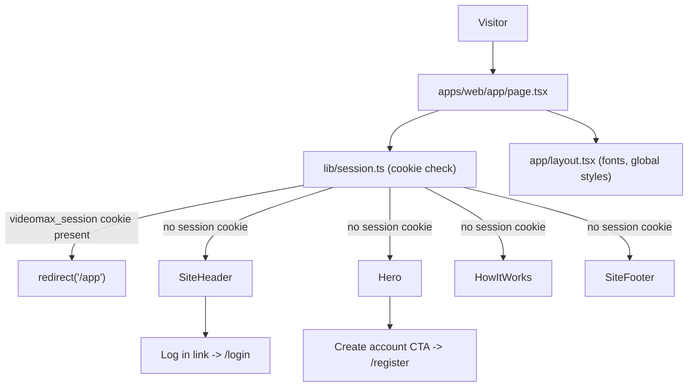

# Spec: F01. Landing Page

## 1. Technical Overview

**What:** A public, unauthenticated marketing page served at the root URL (`/`) of the `videomax` frontend. The page presents a minimalist, HubSpot-inspired hero section, a short "how it works" strip, and a footer, with calls to action routing visitors to registration (`/register`) or login (`/login`). Already-authenticated visitors who land on `/` are redirected to `/app`.

**Why:** This is the first Foundation feature of the project. Beyond its own marketing content, it is responsible for scaffolding the entire `apps/web/` Next.js frontend application — project initialization, TypeScript configuration, styling system, root layout, and testing tooling — that every subsequent frontend feature (F02–F12) will build on top of. Getting this scaffold right once avoids rework and file conflicts later.

**Scope:**

**Included:**
- The `apps/web/` Next.js (App Router + TypeScript) frontend application scaffold: project initialization, dependency setup, TypeScript configuration, folder conventions, root routing
- Tailwind CSS styling system with a small design-token layer supporting the minimalist visual identity
- Root layout (`app/layout.tsx`): HTML/body shell, font loading, global stylesheet
- The public landing page at `/`: hero section, "how it works" strip, footer
- Top navigation with product logo and a "Log in" link to `/login`
- Primary "Create account" call-to-action linking to `/register`
- Redirect of already-authenticated visitors from `/` to `/app`
- Linting (ESLint), type-checking (TypeScript strict mode), unit/component testing (Vitest + React Testing Library), and end-to-end testing (Playwright) tooling for `apps/web/`
- A root-level npm workspace wiring `apps/web/` (and future `apps/backend/`) together

**Excluded (owned by other features):**
- The `/register` and `/login` page implementations (F02)
- The `/app` library page implementation (F04)
- Real session issuance, password hashing, or any authentication logic (F02) — this feature only reads a placeholder session-cookie contract it defines itself (see Section 3)
- Any backend service, database, or API endpoint — F01 has no `Consumes`/`Provides` block in the PRD and introduces no persistent storage

## 2. Architecture Impact

**Affected components:**
- `apps/web/` — new Next.js application root (monorepo child)
- `apps/web/app/layout.tsx` — new root layout
- `apps/web/app/page.tsx` — new landing page (Server Component)
- `apps/web/app/globals.css` — new global stylesheet
- `apps/web/lib/session.ts` — new placeholder session-check helper
- `apps/web/components/site-header.tsx` — new top navigation
- `apps/web/components/hero.tsx` — new hero section
- `apps/web/components/how-it-works.tsx` — new "how it works" strip
- `apps/web/components/site-footer.tsx` — new footer
- `package.json` (repo root) — new npm workspaces manifest

## 3. Technical Decisions

| Decision | Chosen Approach | Alternative Considered | Trade-off |
|----------|----------------|----------------------|-----------|
| Frontend framework & repo layout | Next.js 14 (App Router) + TypeScript, scaffolded at `apps/web/` inside an npm-workspaces monorepo, matching the PRD's Foundation description | Standalone single-app repo | Monorepo aligns with the PRD's declared `apps/backend/` + `apps/web/` split; adds light workspace tooling overhead |
| Styling approach | Tailwind CSS utility classes plus a small design-token layer (accent color, type scale, spacing) in `tailwind.config.ts` | CSS Modules / styled-components | Tailwind ships fastest for a minimalist, whitespace-heavy design and is the de-facto Next.js default; utility classes trade off some markup readability |
| Package manager / monorepo tooling | npm workspaces (root `package.json` with `apps/*`) | pnpm or yarn workspaces | Zero extra install requirement; slightly slower installs than pnpm, acceptable at this project size |
| Font | `next/font` with Inter, self-hosted | System font stack | Consistent, HubSpot-like sans-serif rendering across browsers; adds a small self-hosted font payload |
| Authenticated-redirect mechanism | `app/page.tsx` (Server Component) reads a placeholder cookie named `videomax_session` directly via `next/headers` and calls `redirect('/app')` when it is present; no global `middleware.ts` is introduced by this feature | Global `middleware.ts` performing the check | Keeps F01 fully self-contained (PRD Section 8 lists no dependency on F02) and avoids a scaffolding collision when F02 later adds its own auth middleware; F02 is expected to formalize and own the real cookie contract |
| Testing stack | Vitest + React Testing Library (unit/component), Playwright (E2E) | Jest + Testing Library | Faster integration with Next.js/TypeScript/ESM; the modern default for new Next.js projects |
| Linting/formatting | ESLint (`eslint-config-next`) + Prettier | Biome | Matches Next.js's default tooling and has the widest plugin support |

**Assumptions (auto-accepted — no PRD/codebase answer existed for these; documented for review):**
- The codebase was completely empty at generation time (no `apps/`, no `package.json`); every decision above is a fresh bootstrap choice, not an observed convention.
- The `videomax_session` cookie name and "presence = authenticated" semantics are a placeholder contract invented by this feature to satisfy its own acceptance criterion ("authenticated users are redirected"). F02 (Authentication System) is expected to adopt this exact cookie name when it implements real session issuance; if F02's interview later chooses a different name, this feature's redirect check must be updated to match — that mismatch is called out explicitly here rather than assumed compatible.
- No project-specific fixture path, seeding, or test-config convention existed yet (greenfield). This feature establishes: fixtures (if any future feature needs them) under `apps/web/tests/fixtures/`; test config via `apps/web/.env.test`; component/unit tests under `apps/web/tests/unit/`; E2E specs under `apps/web/tests/e2e/`. These become the project's convention for subsequent features.
- No quality gates existed yet (no scripts, no CI config). This feature defines the initial gate set (lint, typecheck, unit test, E2E test, build) as individually named npm scripts in `apps/web/package.json`, matching the project's established `## Quality gates` contract convention of listing discrete, independently runnable gate entries (no single merged wrapper command). Subsequent features add their own gate entries to the same list.

## 4. Component Overview

**Frontend:**

| File Path | New/Modified | Purpose | Key Responsibilities |
|-----------|--------------|---------|---------------------|
| `package.json` (root) | New | npm workspaces manifest | Declares `apps/*` as workspaces so per-app scripts (lint, typecheck, test, build) can run via `npm run <script> --workspace apps/web` |
| `apps/web/package.json` | New | Frontend app manifest | Next.js/React/TypeScript/Tailwind/Vitest/Playwright dependencies; `dev`, `build`, `lint`, `typecheck`, `test`, `test:e2e` scripts |
| `apps/web/next.config.ts` | New | Next.js configuration | App Router settings, strict production build |
| `apps/web/tsconfig.json` | New | TypeScript configuration | Strict mode; `@/*` path alias into `apps/web/` |
| `apps/web/tailwind.config.ts` | New | Tailwind configuration | Design tokens (accent color, type scale, spacing) for the minimalist visual identity |
| `apps/web/app/globals.css` | New | Global stylesheet | Tailwind directives, base typography, resets |
| `apps/web/app/layout.tsx` | New | Root layout (Server Component) | Wraps every page in `<html>/<body>`; loads the Inter font via `next/font`; imports global styles |
| `apps/web/app/page.tsx` | New | Landing page (Server Component) | Reads the session cookie and redirects authenticated visitors to `/app`; otherwise composes `SiteHeader`, `Hero`, `HowItWorks`, `SiteFooter` |
| `apps/web/lib/session.ts` | New | Session cookie helper | Exposes `hasActiveSession()`, reading the `videomax_session` cookie via `next/headers`; documents the placeholder contract F02 will formalize |
| `apps/web/components/site-header.tsx` | New | Top navigation bar | Renders the product logo/name and a "Log in" link to `/login` |
| `apps/web/components/hero.tsx` | New | Hero section | Product name, one-sentence value proposition, supporting paragraph, "Create account" CTA linking to `/register` |
| `apps/web/components/how-it-works.tsx` | New | "How it works" strip | Three-step summary: Upload → Transcribe → Summarize |
| `apps/web/components/site-footer.tsx` | New | Footer | Minimal footer with product name and copyright line |
| `apps/web/vitest.config.ts` | New | Unit/component test runner config | jsdom environment, React Testing Library setup |
| `apps/web/playwright.config.ts` | New | E2E test runner config | Base URL, browser projects for the landing-page flow |

**Backend:** None — this feature has no `Consumes`/`Provides` block in the PRD and introduces no server-side logic.

**Database:** None — this feature introduces no persistent storage. (Do not confuse with F02's future `users`/session schema, which is out of scope here.)

## 5. API Contracts

Not applicable. F01 exposes no backend endpoints — the landing page is a statically rendered Next.js page with a client-side-invisible, server-side cookie check.

## 6. Data Model

Not applicable. F01 introduces no database tables, migrations, or persistent entities.

## 7. Testing Strategy

**Test File Structure:**

| Test File | Test Type | Target | Coverage Goal |
|-----------|-----------|--------|---------------|
| `apps/web/tests/unit/site-header.test.tsx` | Unit/Component | `SiteHeader` | 90% |
| `apps/web/tests/unit/hero.test.tsx` | Unit/Component | `Hero` | 90% |
| `apps/web/tests/unit/how-it-works.test.tsx` | Unit/Component | `HowItWorks` | 90% |
| `apps/web/tests/unit/session.test.ts` | Unit | `lib/session.ts` | 90% |
| `apps/web/tests/unit/page.test.tsx` | Component | `app/page.tsx` (composition + redirect branch) | 85% |
| `apps/web/tests/e2e/landing.spec.ts` | E2E | Full landing page flow in a real browser | Key user flows |

**Test functions:**

| Test Function | Description | Assertions |
|---------------|-------------|------------|
| `renders logo and login link` (`site-header.test.tsx`) | SiteHeader renders both elements | Logo text present; "Log in" link has `href="/login"` |
| `renders hero copy and CTA` (`hero.test.tsx`) | Hero renders headline, subhead, CTA | Headline/subhead text present; CTA link has `href="/register"` |
| `renders three steps in order` (`how-it-works.test.tsx`) | Strip renders Upload/Transcribe/Summarize in order | Three step labels present in document order |
| `returns false with no cookie` (`session.test.ts`) | `hasActiveSession()` with an empty cookie jar | Returns `false` |
| `returns true when videomax_session is set` (`session.test.ts`) | `hasActiveSession()` with the cookie present | Returns `true` regardless of cookie value content |
| `renders landing sections when unauthenticated` (`page.test.tsx`) | Page composition without the session cookie | `SiteHeader`, `Hero`, `HowItWorks`, `SiteFooter` all render |
| `redirects when authenticated` (`page.test.tsx`) | Page behavior with the session cookie present | Redirect to `/app` is triggered; landing sections do not render |
| `landing page loads and links resolve` (`landing.spec.ts`) | Full-page E2E smoke test | Page loads at `/`; CTA href is `/register`; nav link href is `/login` |
| `authenticated visitor redirected to /app` (`landing.spec.ts`) | E2E redirect flow | With `videomax_session` cookie set, navigating to `/` ends on `/app` |
