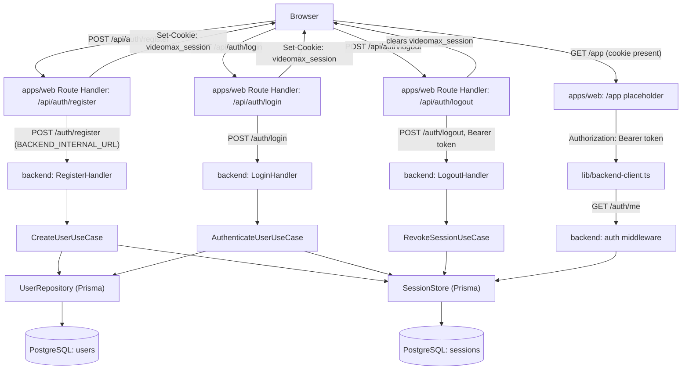

# Spec: F02. Authentication System

## 1. Technical Overview

**What:** A session-based authentication system spanning both apps of the monorepo. `apps/backend/` is scaffolded for the first time as a standalone Node.js/TypeScript HTTP service following clean architecture (domain/usecase/infra), exposing `POST /auth/register`, `POST /auth/login`, and `POST /auth/logout`. `apps/web/` gains `/register` and `/login` pages plus a set of Next.js Route Handlers that proxy those three endpoints, translating the backend's issued session token into the first-party `videomax_session` cookie that F01 already established as the platform's authenticated-visitor signal.

**Why:** F02 is the second Foundation feature (PRD Section 8). It scaffolds `apps/backend/` — the system of record for all data and business rules — and the server-side session store and authentication middleware that every future authenticated backend route (F03–F12) will run behind. On the frontend, it wires the proxy pattern ("authenticated requests are proxied through Next.js Route Handlers so session cookies stay first-party") that every future authenticated frontend call reuses.

**Scope:**

**Included:**
- `apps/backend/` scaffold: Node.js 20+/TypeScript 5 project, clean architecture skeleton (`domain/`, `usecase/`, `infra/`, `config/`, `main.ts`), Fastify HTTP adapter, Prisma + PostgreSQL persistence, zod validation, and the full quality-gate tooling (ESLint, dependency-cruiser, architecture check, madge, knip, Vitest)
- `User` domain aggregate (entity, `Email` VO, `HashedPassword` VO, `UserId` VO, per-feature errors) and its initial persistence migration
- Registration: full name, email, password, with password-strength and email-uniqueness rules
- Login: credential verification with a generic failure message
- Session issuance, verification, and invalidation (the "server-side session store")
- Authentication middleware (`infra/http/middleware/auth.ts`) resolving the caller on every protected backend route
- `apps/web` Next.js Route Handlers proxying register/login/logout and managing the first-party `videomax_session` cookie
- `/register` and `/login` frontend pages with inline validation error display
- A minimal placeholder `/app` landing page and a "Log out" control, delivered by this feature only so its own logout AC is verifiable before F04 (Video Library, which owns the real `/app`) exists — see Technical Decisions

**Excluded (owned by other features):**
- The real `/app` library view, its layout, and its navigation chrome (F04) — this feature's `/app/page.tsx` is a temporary placeholder F04 replaces wholesale
- The `is_admin`-gated `/admin` area and any suspend/reactivate/delete-user administration (F12) — F12 depends on F02 and will add its own migration/use cases on top of the `users` table this feature creates
- OAuth/SSO, two-factor authentication, email verification, password recovery/reset (PRD Section 7, Out of Scope)
- Video upload, library, folders, tags, and every other post-login feature (F03–F12)

## 2. Architecture Impact

**Affected components:**
- `apps/backend/` — new Node.js application root (monorepo child), full clean-architecture skeleton
- `apps/backend/prisma/schema.prisma`, `apps/backend/prisma/migrations/`, `apps/backend/prisma/seed.ts` — new persistence schema, initial migration, seed script
- `apps/backend/src/domain/user/`, `apps/backend/src/domain/session/` — new domain aggregates
- `apps/backend/src/usecase/user/`, `apps/backend/src/usecase/session/` — new use cases
- `apps/backend/src/infra/http/auth/`, `apps/backend/src/infra/http/middleware/auth.ts` — new handlers, routes, middleware
- `apps/backend/src/infra/repository/user/`, `apps/backend/src/infra/repository/session/` — new Prisma + in-memory implementations
- `apps/backend/src/main.ts` — new composition root
- `apps/web/app/register/page.tsx`, `apps/web/app/login/page.tsx` — new frontend pages
- `apps/web/app/app/page.tsx` — new placeholder authenticated landing page (temporary; F04-owned long-term)
- `apps/web/app/api/auth/register/route.ts`, `.../login/route.ts`, `.../logout/route.ts` — new proxy Route Handlers
- `apps/web/lib/session.ts` — modified (extends F01's placeholder helper with a token accessor)
- `apps/web/lib/backend-client.ts` — new authenticated backend-call helper
- `apps/web/components/register-form.tsx`, `apps/web/components/login-form.tsx`, `apps/web/components/logout-button.tsx` — new client components
- root `package.json` — modified (adds `apps/backend` to `workspaces`, adds `dev:backend`/`gates` scripts)
- root `docker-compose.yml` — new (local PostgreSQL for development/testing)



## 3. Technical Decisions

| Decision | Chosen Approach | Alternative Considered | Trade-off |
|----------|----------------|----------------------|-----------|
| Backend framework, ORM, DB | Fastify 5 + Prisma 5 + PostgreSQL 16, per this project's own `clean-arch` skill scaffold templates (`templates/scaffold/backend-db/`), which already fix this exact combination (framework-agnostic `Handler`/`HttpRequest`/`HttpResponse` bridge in `main.ts`) | Express, raw `node:http`; a different ORM/DB | The skill's own reference material (domain-modeling.md, repository-and-queries.md, error-handling.md) is written using this exact stack for this exact project; deviating would fight the established convention on every future backend feature |
| Password strength + hashing | A single `HashedPassword` VO: `HashedPassword.create(raw)` validates PRD's rule (≥8 chars, ≥1 letter, ≥1 digit) via zod, throwing `WeakPasswordError(reasons: string[])` on failure, then hashes with `bcryptjs` (cost factor 10) before storing | Separate `Password` (strength) + `HashedPassword` (hash) VOs; native `bcrypt` binding | `bcryptjs` is pure JavaScript — no native compilation step, which keeps the evaluator/CI environment simple. A single VO matches `error-handling.md`'s own `WeakPasswordError` example verbatim |
| Session mechanism | Opaque random token (32 bytes, base64url) generated at login/register time. The backend stores only an HMAC-SHA256 digest of the token (keyed by `SESSION_SECRET`) in a `sessions` table, never the raw token. The raw token is returned once, in the JSON response body, to the caller (the Next.js server) | Signed JWT (stateless) | A DB-backed opaque token supports true server-side invalidation on logout (a JWT would remain "valid" until expiry unless a revocation list is added — extra complexity this feature does not need). Storing a digest, not the raw token, means a database leak alone cannot be replayed as a valid session |
| Session transport backend↔frontend | The backend is a pure internal API, called only by the Next.js server (never directly by the browser); it authenticates via `Authorization: Bearer <token>`, not a cookie. Only `apps/web`'s Route Handlers translate the token into the first-party `videomax_session` cookie set on the browser | Backend sets `Set-Cookie` directly | The backend and frontend run on different ports/origins in development (`:4000` vs `:3000`); a cookie the backend sets would not reliably reach the browser as first-party. Centralizing cookie-setting in the Next.js proxy is exactly what PRD Section 8 describes ("authenticated requests are proxied through Next.js Route Handlers so session cookies stay first-party") |
| Cookie name | Reuse `videomax_session`, exactly as F01 defined it in `apps/web/lib/session.ts` (`SESSION_COOKIE_NAME`) | Introduce a new name | F01's spec explicitly flagged this cookie name as a placeholder for F02 to adopt verbatim; reusing it avoids a second migration of F01's redirect check |
| Session lifetime | Fixed 30-day expiry from issuance (no sliding renewal in this release) | Sliding expiration; "remember me" toggle | PRD does not specify a duration or a remember-me control; a flat, generous default keeps the mechanism simple and matches a single-device personal-use product (PRD Section 3, "single personal desktop or laptop") |
| `users` schema includes `isAdmin`/`isSuspended` now | Add `isAdmin: Boolean @default(false)` and `isSuspended: Boolean @default(false)` to the initial migration, unused by any of this feature's own use cases | Add them later in F12's own migration | This project's `clean-arch` skill reference (`domain-modeling.md`) already ships its canonical `User` entity example with exactly these two fields, and F12 (the only feature that will use them) depends on F02 without owning the `users` table itself — adding them now avoids a second Foundation-adjacent migration later for a two-column, zero-behavior change |
| `/app` placeholder page | F02 delivers a minimal `apps/web/app/app/page.tsx` (current user's name + a "Log out" button) purely so its own "logout redirects to `/`" and "login/registration redirect to `/app`" ACs are exercisable without depending on F04 | Skip the AC verification for logout until F04 exists | F04 (Video Library, the real owner of `/app`) is outside F02's PRD Section 8 dependency closure (F04 depends on F02, not the reverse). Applying the Preparation Pattern, F02 must deliver its own minimal stand-in rather than reach into F04's scope. F04 is expected to replace this file wholesale when it implements the real library view at the same route |
| Backend↔frontend internal API base URL | `BACKEND_INTERNAL_URL` env var on `apps/web`, defaulting to `http://localhost:4000`, matching the name and default already established by this project's `clean-arch` skill scaffold (`templates/scaffold/web-overlay/lib/backend.ts`) | Invent a new env var name | Reusing the exact name keeps every future frontend→backend call (F03+) consistent with the one this feature introduces |
| Quality gates | Reuse the root `npm run gates` wrapper (`scripts/run-gates.mjs`, already defined by this project's `clean-arch` skill scaffold) as a single consolidated gate covering the backend's TypeScript/ESLint/dependency-cruiser/architecture-check/madge/knip checks, plus two discrete backend gates (`test`, `build`) it does not cover, alongside `apps/web`'s existing five discrete gates (`lint`/`typecheck`/`test`/`test:e2e`/`build`) | List all six backend structural checks as separate contract entries | The project already ships a wrapper that consolidates exactly these checks; listing them again one-by-one would duplicate that tooling instead of reusing it |

**Assumptions (auto-accepted — "auto accept" mode; no interactive interview was run for this feature; every open decision below applies this project's own `clean-arch` skill conventions or an industry-standard default, and is flagged here for review):**
- This project's `.claude/skills/clean-arch/` skill functions as the authoritative backend convention source (its own reference docs are written using this exact `User`/`Session` domain, so its stack and folder choices are treated as settled, not merely suggested)
- Persistent-state seeding convention (backend, greenfield — no prior backend feature to observe): a Prisma seed script at `apps/backend/prisma/seed.ts`, wired via a `"prisma": {"seed": "tsx prisma/seed.ts"}` block in `apps/backend/package.json` (Prisma's own standard convention, run via `npx prisma db seed`). This becomes the project's seeding convention for F03–F12
- Test configuration convention (backend, greenfield): `apps/backend/.env.test`, mirroring the `.env.test` convention F01's spec already established for `apps/web`
- Static-input/fixture convention (backend, greenfield): `apps/backend/tests/_shared/` for cross-cutting test infrastructure (builders, fixtures), per `clean-arch` skill's `folder-structure.md` §5 — not populated by this feature (no file fixtures are needed for authentication), but declared for F03+ to reuse
- No rate-limiting or account lockout on repeated failed login attempts — not mentioned by the PRD's Capabilities or Error Handling for F02, and PRD Section 7 does not list it as explicitly out of scope either; omitted to avoid inventing an unspecified policy. Can be added later without changing this feature's contract
- No CSRF token scheme beyond the cookie's own `SameSite=Lax` attribute — PRD does not mention CSRF, and `SameSite=Lax` is the standard baseline mitigation for a same-site form-post flow
- Full name field: 1–200 characters, trimmed, non-empty (no additional format rule) — PRD requires "full name" without further constraint; this mirrors F04's already-established video-title length convention (1–200 chars) for consistency, applied here as a reasonable default since no prior user-name convention exists

## 4. Component Overview

**Backend:**

| File Path | New/Modified | Purpose | Key Responsibilities |
|-----------|--------------|---------|---------------------|
| `apps/backend/package.json` | New | Backend app manifest | Fastify/Prisma/zod/bcryptjs dependencies; `dev`, `build`, `start`, `lint`, `typecheck`, `test`, `depcruise`, `check-arch`, `circular`, `orphans`, `prisma:generate`, `prisma:migrate`, `prisma:migrate:dev` scripts; `prisma.seed` config |
| `apps/backend/tsconfig.json` | New | TypeScript configuration | Strict mode; `@/*` path alias into `apps/backend/src/` |
| `apps/backend/.eslintrc`/`eslint.config.mjs` | New | Lint rules | `no-restricted-syntax`/`no-restricted-properties` banning `process.env` outside `config/`; layer-import restrictions |
| `apps/backend/.dependency-cruiser.cjs` | New | Cross-layer import rules | `no-prisma-outside-infra`, domain/usecase/infra dependency direction enforcement |
| `apps/backend/scripts/check-architecture.ts` | New | Structural self-audit | Mirrored-folder check, in-memory-fake presence check, per this project's `clean-arch` skill |
| `apps/backend/prisma/schema.prisma` | New | Persistence schema | `User` and `Session` models (see Data Model) |
| `apps/backend/prisma/migrations/<ts>_init/migration.sql` | New | Initial migration | Creates `users` and `sessions` tables |
| `apps/backend/prisma/seed.ts` | New | Seed script | Establishes this project's persistent-state seeding convention; seeds the fixture user used by this feature's own contract |
| `apps/backend/.env.example` | New | Env template | `PORT`, `DATABASE_URL`, `SESSION_SECRET`, `LOG_LEVEL` |
| `apps/backend/.env.test` | New | Test env | Points `DATABASE_URL` at an ephemeral/test database; a fixed `SESSION_SECRET` test value |
| `apps/backend/src/config/env.ts` | New | Typed env parsing | zod schema for `port`, `databaseUrl`, `sessionSecret`, `logLevel`; the only file reading `process.env` |
| `apps/backend/src/domain/_shared/errors.ts` | New | Shared error hierarchy | `AppError`, `DomainError`, `NotFoundError`, `ConflictError` (abstract); `UnauthenticatedError`, `ForbiddenError`, `InvalidIdError` (concrete) |
| `apps/backend/src/domain/_shared/id.vo.ts` | New | Base `Id` VO | `Id.generate()`, `Id.from(string)` |
| `apps/backend/src/domain/user/user.entity.ts` | New | `User` aggregate | `create`/`restore` factories; `changeEmail`; getters incl. `isAdmin`, `isSuspended` (unused by this feature's own use cases, reserved for F12); `toJSON(): never` |
| `apps/backend/src/domain/user/user-id.vo.ts` | New | `UserId` VO | Extends `Id` |
| `apps/backend/src/domain/user/email.vo.ts` | New | `Email` VO | Format validation (zod `.email()`, trim, lowercase); `fromTrusted` for rehydration |
| `apps/backend/src/domain/user/hashed-password.vo.ts` | New | `HashedPassword` VO | Strength validation + bcrypt hashing on `create`; `restore` skips both; `compare(plain)` for login |
| `apps/backend/src/domain/user/user.repository.ts` | New | `UserRepository` interface | `findById`, `findByEmail`, `save` |
| `apps/backend/src/domain/user/errors.ts` | New | User errors | `InvalidEmailError`, `WeakPasswordError`, `UserNotFoundError`, `UserAlreadyExistsError` |
| `apps/backend/src/domain/session/session.entity.ts` | New | `Session` aggregate | `create` (generates token + digest + expiry), `restore`; `isExpired()` |
| `apps/backend/src/domain/session/session-token.vo.ts` | New | `SessionToken` VO | Raw-token generation (32 random bytes, base64url) and HMAC-SHA256 digesting keyed by a secret passed at call time (never read from `process.env` inside `domain/`) |
| `apps/backend/src/domain/session/session.repository.ts` | New | `SessionStore`-equivalent interface | `save`, `findByTokenDigest`, `deleteByTokenDigest` |
| `apps/backend/src/domain/session/errors.ts` | New | Session errors | `SessionNotFoundError` (used internally; surfaces as `UnauthenticatedError` at the middleware boundary) |
| `apps/backend/src/usecase/user/create-user.usecase.ts` + `.dto.ts` | New | Registration | Checks email uniqueness, creates `User`, creates a `Session`, persists both, returns user + raw token |
| `apps/backend/src/usecase/user/authenticate-user.usecase.ts` + `.dto.ts` | New | Login | Loads user by email, compares password via `HashedPassword.compare`, creates a `Session`, returns user + raw token |
| `apps/backend/src/usecase/session/revoke-session.usecase.ts` + `.dto.ts` | New | Logout | Deletes the session matching the presented token's digest; idempotent (no error when already absent) |
| `apps/backend/src/usecase/session/resolve-session.usecase.ts` + `.dto.ts` | New | Session resolution | Used by the auth middleware: looks up a token digest, loads the owning user, returns `{id, isAdmin}` or `null` |
| `apps/backend/src/infra/repository/user/user.prisma-repository.ts` + `user.mapper.ts` | New | User persistence (production) | Implements `UserRepository` via Prisma |
| `apps/backend/src/infra/repository/user/user.in-memory-repository.ts` | New | User persistence (fake) | LSP-substitutable in-memory implementation for tests |
| `apps/backend/src/infra/repository/session/session.prisma-repository.ts` + mapper | New | Session persistence (production) | Implements the session repository via Prisma |
| `apps/backend/src/infra/repository/session/session.in-memory-repository.ts` | New | Session persistence (fake) | In-memory implementation for tests |
| `apps/backend/src/infra/http/types.ts`, `handler.ts`, `error-handler.ts` | New | Framework-agnostic HTTP contracts | `HttpRequest`/`HttpResponse`/`HttpRoute`, `Handler` interface, `toHttpResponse(err)` central mapper |
| `apps/backend/src/infra/http/middleware/auth.ts` | New | Auth middleware | Resolves `Authorization: Bearer <token>` via `ResolveSessionUseCase`; populates `req.user`; throws `UnauthenticatedError` on protected routes with no/invalid token; skips public routes (`/auth/register`, `/auth/login`) |
| `apps/backend/src/infra/http/auth/register.handler.ts` | New | Registration handler | zod body schema; calls `CreateUserUseCase`; maps to `201` |
| `apps/backend/src/infra/http/auth/login.handler.ts` | New | Login handler | zod body schema; calls `AuthenticateUserUseCase`; maps to `200` |
| `apps/backend/src/infra/http/auth/logout.handler.ts` | New | Logout handler | Reads bearer token; calls `RevokeSessionUseCase`; maps to `204` |
| `apps/backend/src/infra/http/auth/me.handler.ts` | New | Current-session handler | Returns the authenticated caller's public profile; used by the frontend's `/app` placeholder |
| `apps/backend/src/infra/http/auth/auth.routes.ts` | New | Route wiring | Exports `authRoutes(deps): HttpRoute[]` for `POST /auth/register`, `POST /auth/login`, `POST /auth/logout`, `GET /auth/me` |
| `apps/backend/src/infra/http/index.ts` | New | Route aggregator | `buildHttpRoutes(deps)` — the single allowed barrel |
| `apps/backend/src/infra/http/fastify-server.ts` | New | Framework adapter | Bridges Fastify request/response to `HttpRequest`/`HttpResponse`; mounts `authMiddleware`; registers routes |
| `apps/backend/src/main.ts` | New | Composition root | Instantiates `PrismaClient`, repositories, use cases, handlers, routes, starts the Fastify server on `config.port` |

**Frontend:**

| File Path | New/Modified | Purpose | Key Responsibilities |
|-----------|--------------|---------|---------------------|
| `apps/web/lib/session.ts` | Modified | Session cookie helper (F01) | Adds `getSessionToken(): Promise<string \| null>` alongside the existing `hasActiveSession()`, reading the same `videomax_session` cookie |
| `apps/web/lib/backend-client.ts` | New | Authenticated backend-call helper | `backendFetch(path, init, token?)` — sets `Authorization: Bearer <token>` when present; reads `BACKEND_INTERNAL_URL` (default `http://localhost:4000`) |
| `apps/web/app/api/auth/register/route.ts` | New | Registration proxy | Forwards JSON body to backend `POST /auth/register`; on success, sets the `videomax_session` cookie (httpOnly, `sameSite=lax`, `secure` in production, 30-day `maxAge`, `path=/`) from the returned token; forwards error `code`/`message`/`details` verbatim on failure |
| `apps/web/app/api/auth/login/route.ts` | New | Login proxy | Same shape as register, calling backend `POST /auth/login` |
| `apps/web/app/api/auth/logout/route.ts` | New | Logout proxy | Reads the cookie token via `getSessionToken()`, calls backend `POST /auth/logout` with it (skips the call entirely when no cookie is present), always clears the cookie, always responds success |
| `apps/web/app/register/page.tsx` | New | Registration page (Server Component shell) | Renders `RegisterForm`; redirects to `/app` if already authenticated (reuses F01's `hasActiveSession()`) |
| `apps/web/app/login/page.tsx` | New | Login page (Server Component shell) | Renders `LoginForm`; redirects to `/app` if already authenticated |
| `apps/web/components/register-form.tsx` | New | Registration form (Client Component) | Name/email/password/confirm fields; posts to `/api/auth/register`; inline field-level error rendering; on success, client-side navigates to `/app` |
| `apps/web/components/login-form.tsx` | New | Login form (Client Component) | Email/password fields; posts to `/api/auth/login`; generic inline error on failure; on success, navigates to `/app` |
| `apps/web/components/logout-button.tsx` | New | Logout control (Client Component) | Posts to `/api/auth/logout`; navigates to `/` regardless of the proxy's response |
| `apps/web/app/app/page.tsx` | New | Placeholder authenticated landing (temporary — see Technical Decisions) | Redirects to `/` if unauthenticated; otherwise fetches `GET /auth/me` via `backend-client.ts` and renders the user's name plus `LogoutButton` |

**Database:**

- New `users` and `sessions` tables — see Data Model. This is F02's own persistence schema; no other feature's tables are affected.

## 5. API Contracts

All backend endpoints are mounted at the backend's root (default `http://localhost:4000`) and are called **only** by `apps/web`'s Route Handlers — never directly by the browser. Errors follow this project's central `toHttpResponse` shape: `{ code: string, message: string, details?: unknown }`.

### `POST /auth/register` (public)

Request:
```json
{ "name": "Ada Lovelace", "email": "ada@example.com", "password": "AdaPass123" }
```

Success `201`:
```json
{
  "user": { "id": "…", "name": "Ada Lovelace", "email": "ada@example.com", "isAdmin": false, "createdAt": "2026-01-01T00:00:00.000Z" },
  "sessionToken": "base64url-opaque-token"
}
```

Errors:
- `422 WEAK_PASSWORD` — `{ code: "WEAK_PASSWORD", message: "Password too weak: …", details: { reasons: ["too_short" | "missing_letter" | "missing_number", ...] } }`
- `422 INVALID_EMAIL` — malformed email
- `409 USER_ALREADY_EXISTS` — email already registered
- `400 VALIDATION_ERROR` — malformed request shape (missing/mistyped fields)

### `POST /auth/login` (public)

Request:
```json
{ "email": "ada@example.com", "password": "AdaPass123" }
```

Success `200`: same body shape as registration's success response (`user`, `sessionToken`).

Errors:
- `401 UNAUTHENTICATED` — `{ code: "UNAUTHENTICATED", message: "Invalid email or password" }` for both "no such user" and "wrong password" — the message never discloses which
- `400 VALIDATION_ERROR` — malformed request shape

### `POST /auth/logout` (protected — but tolerant of an absent/invalid token)

Request headers: `Authorization: Bearer <sessionToken>` (optional).

Success `204`: no body. Returned whether or not the token matched an active session (idempotent).

### `GET /auth/me` (protected)

Request headers: `Authorization: Bearer <sessionToken>` (required).

Success `200`:
```json
{ "id": "…", "name": "Ada Lovelace", "email": "ada@example.com", "isAdmin": false }
```

Errors:
- `401 UNAUTHENTICATED` — missing or unresolvable token

### Frontend proxy Route Handlers

`apps/web`'s `/api/auth/register`, `/api/auth/login`, `/api/auth/logout` accept the same JSON request shapes as their backend counterparts (logout accepts no body) and forward the backend's status/error body unchanged, except that a successful register/login response's `sessionToken` is consumed to set the `videomax_session` cookie and is **not** included in the proxy's own JSON response body (the browser never sees the raw token, only the cookie).

## 6. Data Model

```prisma
// apps/backend/prisma/schema.prisma
generator client {
  provider = "prisma-client-js"
}

datasource db {
  provider = "postgresql"
  url      = env("DATABASE_URL")
}

model User {
  id             String    @id @default(uuid())
  name           String
  email          String    @unique
  hashedPassword String
  isAdmin        Boolean   @default(false)
  isSuspended    Boolean   @default(false)
  createdAt      DateTime  @default(now())
  updatedAt      DateTime  @updatedAt
  sessions       Session[]

  @@map("users")
}

model Session {
  id         String   @id @default(uuid())
  userId     String
  tokenHash  String   @unique
  createdAt  DateTime @default(now())
  expiresAt  DateTime
  user       User     @relation(fields: [userId], references: [id], onDelete: Cascade)

  @@index([userId])
  @@map("sessions")
}
```

Notes:
- `users.email` carries a unique index — the backing store for `UserAlreadyExistsError`.
- `sessions.tokenHash` carries a unique index (the HMAC-SHA256 digest of the raw token, keyed by `SESSION_SECRET`) — never the raw token. `onDelete: Cascade` removes a user's sessions if the user row is ever deleted (relevant to F12 later; harmless now).
- `isAdmin`/`isSuspended` are written only with their defaults by this feature; F12 is the first feature to mutate them.

## 7. Testing Strategy

**Test File Structure:**

| Test File | Test Type | Target | Coverage Goal |
|-----------|-----------|--------|---------------|
| `apps/backend/src/domain/user/user.entity.spec.ts` | Unit | `User` entity | 90% |
| `apps/backend/src/domain/user/email.vo.spec.ts` | Unit | `Email` VO | 90% |
| `apps/backend/src/domain/user/hashed-password.vo.spec.ts` | Unit | `HashedPassword` VO (strength rules + hashing + `compare`) | 90% |
| `apps/backend/src/domain/session/session.entity.spec.ts` | Unit | `Session` entity (token generation, digesting, expiry) | 90% |
| `apps/backend/src/usecase/user/create-user.usecase.spec.ts` | Unit | `CreateUserUseCase` (fakes) | 90% |
| `apps/backend/src/usecase/user/authenticate-user.usecase.spec.ts` | Unit | `AuthenticateUserUseCase` (fakes) | 90% |
| `apps/backend/src/usecase/session/revoke-session.usecase.spec.ts` | Unit | `RevokeSessionUseCase` (fakes) | 90% |
| `apps/backend/src/usecase/session/resolve-session.usecase.spec.ts` | Unit | `ResolveSessionUseCase` (fakes) | 90% |
| `apps/backend/src/infra/http/auth/register.handler.spec.ts` | Integration | Registration handler (schema + use case wiring) | 85% |
| `apps/backend/src/infra/http/auth/login.handler.spec.ts` | Integration | Login handler | 85% |
| `apps/backend/src/infra/http/fastify-server.spec.ts` | Integration | Full route wiring against an in-memory-backed server instance | Key flows |
| `apps/web/tests/unit/register-form.test.tsx` | Component | `RegisterForm` | 85% |
| `apps/web/tests/unit/login-form.test.tsx` | Component | `LoginForm` | 85% |
| `apps/web/tests/unit/session.test.ts` | Unit | `lib/session.ts` (`getSessionToken` addition) | 90% |
| `apps/web/tests/e2e/auth.spec.ts` | E2E | Full register/login/logout flow in a real browser against the real backend | Key user flows |

**Test functions:**

| Test Function | Description | Assertions |
|---------------|-------------|------------|
| `hashes and verifies a strong password` (`hashed-password.vo.spec.ts`) | `HashedPassword.create` then `.compare` | Correct password matches; wrong password does not |
| `rejects a password missing a digit` (`hashed-password.vo.spec.ts`) | Strength validation | Throws `WeakPasswordError` with `reasons` including a missing-number indicator |
| `persists a new user and issues a session` (`create-user.usecase.spec.ts`) | Happy path | Output includes `user` + non-empty `sessionToken`; repository holds the new user |
| `throws UserAlreadyExistsError for a duplicate email` (`create-user.usecase.spec.ts`) | Uniqueness rule | Rejects with the typed error; no second row created |
| `authenticates with correct credentials` (`authenticate-user.usecase.spec.ts`) | Happy path | Returns user + token |
| `rejects wrong password with a generic error` (`authenticate-user.usecase.spec.ts`) | Failure path | Throws `UnauthenticatedError` regardless of whether the email exists |
| `revokes an existing session` / `is idempotent when the token is unknown` (`revoke-session.usecase.spec.ts`) | Logout | Session removed from the store; second call does not throw |
| `register → auto-login → /app` (`auth.spec.ts`, E2E) | Full registration flow | Ends on `/app`; `videomax_session` cookie present |
| `login with valid credentials redirects to /app` (`auth.spec.ts`, E2E) | Login flow | Ends on `/app`; cookie present |
| `login with wrong password shows generic error` (`auth.spec.ts`, E2E) | Login failure | Generic message shown; stays on `/login` |
| `logout redirects to / and clears the cookie` (`auth.spec.ts`, E2E) | Logout flow | Ends on `/`; cookie absent afterward |
