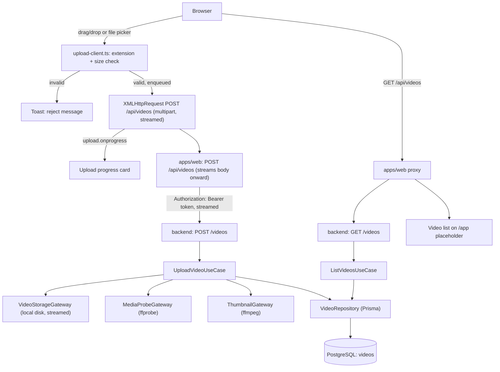

# Spec: F03. Video Upload

## 1. Technical Overview

**What:** Drag-and-drop / file-picker video upload from the browser, streamed through the existing `apps/web` → `apps/backend` proxy into local-disk storage, with a `Video` record created immediately (status `validating`), an exact duration probe, and a best-effort extracted thumbnail. The uploaded video becomes visible in a minimal library view while the user keeps browsing.

**Why:** F03 is the first non-Foundation feature and the entry point of the whole product: every later feature (F04 Library, F05 Folders, F06 Tags, F07 Pipeline, F08 Player, F11 Notifications, F12 Admin) consumes the video file and metadata this feature produces. It depends only on F02 (Authentication System) for the authenticated-request plumbing (session cookie → bearer token → `actorId`).

**Scope:**

**Included:**
- Client-side extension/size validation before transfer starts (reject with a message; no request sent)
- Single-file upload at a time per browser session, with additional files auto-queued and started sequentially
- Streamed multipart upload from browser → Next.js proxy → backend → local disk (no 2GB in-memory buffering anywhere in the path)
- `Video` domain aggregate + persistence (Prisma `videos` table) — the "system of record" this feature owns, mirroring how F02 owns `users`/`sessions`
- Duration probe (`ffprobe`) and thumbnail extraction (`ffmpeg`, frame at ~10% duration, JPEG) run synchronously as part of the upload use case, with the thumbnail failure path degrading gracefully (video still stored, no thumbnail, upload not blocked)
- A minimal video list + upload progress card + drop zone, extending F02's placeholder `/app` page (Preparation Pattern — see Technical Decisions), so this feature's own ACs ("appears in the library", "keep browsing while uploading") are verifiable before F04 exists
- Backend: `POST /videos` (create + stream to disk) and `GET /videos` (list current user's videos) — the second endpoint exists purely so this feature's own placeholder UI has something to render; F04 replaces it with the real library read model

**Excluded (owned by other features):**
- The real library page — grid/list toggle, sort, rename, delete, empty state (F04)
- The 2-hour duration **enforcement** (failing the video into `failed` status) — the PRD explicitly assigns this to F07's "validate stage" (`videomax` PRD §6 F07 Capabilities: "Validate stage: probes the file to confirm it is readable, duration is within 2 hours, and codecs are supported"). F03 stores the exact duration; F03 does not fail videos over 2 hours
- Any status transition beyond `validating` (`transcribing`, `summarizing`, `ready`, `failed`) — those belong to F07
- Folders, tags, the in-app notification panel, the video player, transcription, summaries (F05, F06, F11, F08, F09, F10)
- Admin-side video aggregation (F12)

## 2. Architecture Impact

**Affected components:**
- `apps/backend/prisma/schema.prisma`, new migration — `videos` table
- `apps/backend/src/domain/video/` — new `Video` aggregate, `VideoStatus`/`VideoId` VOs, errors
- `apps/backend/src/domain/video/video-storage.gateway.ts` — new gateway interface (domain-owned, stream-based)
- `apps/backend/src/usecase/video/` — new `UploadVideoUseCase`, `ListVideosUseCase`
- `apps/backend/src/infra/gateway/local-disk-video-storage.gateway.ts` — new, streams to `STORAGE_ROOT`
- `apps/backend/src/infra/gateway/ffprobe-media-probe.gateway.ts`, `ffmpeg-thumbnail.gateway.ts` — new, shell out to system binaries
- `apps/backend/src/infra/repository/video/` — new Prisma + in-memory repository
- `apps/backend/src/infra/http/video/` — new handlers, routes (`upload.handler.ts`, `list.handler.ts`, `video.routes.ts`)
- `apps/backend/src/main.ts` — modified, registers `@fastify/multipart` and wires the new use cases/handlers
- `apps/backend/src/config/env.ts` — modified, adds `STORAGE_ROOT`
- `apps/web/app/api/videos/route.ts` — new proxy Route Handler (streamed `POST`, plain `GET`)
- `apps/web/app/app/page.tsx` — modified, composes the new upload UI (was F02's bare placeholder)
- `apps/web/components/upload-dropzone.tsx`, `upload-queue.tsx`, `upload-progress-card.tsx`, `video-list.tsx`, `toast.tsx` — new client components
- `apps/web/lib/upload-client.ts` — new, client-side extension/size validation + `XMLHttpRequest` progress + single-flight queue
- `video-samples/` (project root) — new tiny synthetic fixture added alongside the two manually-sourced sample videos already documented in `AGENTS.md`



## 3. Technical Decisions

| Decision | Chosen Approach | Alternative Considered | Trade-off |
|----------|----------------|----------------------|-----------|
| Storage gateway shape | `VideoStorageGateway` interface takes/returns Node **streams**, never a `Buffer` (`store(stream: Readable, key: string): Promise<{ sizeBytes: number }>`, `readStream(key): Readable`, `delete(key): Promise<void>`) | Buffer-based `store(file: Buffer, key: string)`, matching the `clean-arch` skill's own illustrative snippet | The skill's own reference docs never reconcile a Buffer-based signature with 2GB files; buffering a 2GB upload in process memory is a straightforward crash/OOM risk. Streaming is the only viable choice at this file-size ceiling, so this feature deliberately diverges from the skill's toy example and documents why |
| Multipart parsing | `@fastify/multipart` (official Fastify plugin), streaming each part directly to `fs.createWriteStream` via the storage gateway — no full-body buffering at any layer | `multer`, `busboy` directly | `@fastify/multipart` is Fastify's own maintained plugin, already streams by design, and needs no Express-style adapter |
| Browser → proxy → backend transport | The browser sends one `multipart/form-data` `XMLHttpRequest` to `apps/web`'s `POST /api/videos`; the Route Handler reads the incoming request body as a stream and pipes it straight into the outgoing `fetch` to the backend (Node's `duplex: 'half'` streaming fetch), forwarding `Authorization: Bearer <token>` — the same proxy pattern F02 established, now carrying a large binary body instead of JSON | Have the browser upload directly to the backend, bypassing the proxy | PRD Section 8 mandates the proxy pattern project-wide ("authenticated requests are proxied through Next.js Route Handlers so session cookies stay first-party") for every authenticated request, not only auth's own three endpoints. Streaming (not buffering) at the proxy hop keeps this consistent without paying a memory cost |
| Upload progress | Client-side `XMLHttpRequest.upload.onprogress` (not `fetch`, which does not expose upload-progress events in the browsers this product targets) measures browser → proxy bytes sent | Server-Sent Events / WebSocket progress channel | `XMLHttpRequest` progress is standard, requires no new transport, and the browser → proxy hop is representative of overall progress since the proxy streams onward immediately rather than buffering |
| Single-upload-at-a-time + queueing | Enforced entirely client-side: `upload-client.ts` keeps an in-memory queue of pending files and processes them one `XMLHttpRequest` at a time | A server-side job queue / upload lock per user | PRD frames this under F03's own Experience ("single-file upload at a time per user... queues it"), and no background job infrastructure exists yet (that is F07's Background Processing Pipeline, a separate feature in a later wave). A client-side queue satisfies the observable behavior without anticipating F07's infrastructure |
| Video metadata capture order | `UploadVideoUseCase` runs, in order: (1) stream to disk, (2) `ffprobe` for exact duration + container format confirmation, (3) `ffmpeg` thumbnail extraction (best-effort), (4) persist the `Video` row with `status = validating` | Defer probe/thumbnail to a background job | PRD's F03 Capabilities explicitly list "Duration probe captures the exact length in seconds **after the file is stored**" as this feature's own synchronous capability, distinct from F07's later validate-stage duration *check*. Keeping it synchronous also means the video never appears in the list without a duration, avoiding a confusing intermediate UI state |
| Duration/thumbnail tooling | Shell out to the system `ffmpeg`/`ffprobe` binaries via `node:child_process.execFile` (no npm wrapper library) | `fluent-ffmpeg`, `ffmpeg-static` | Both binaries are already on `PATH` in this project's dev environment (confirmed at `/opt/homebrew/bin/{ffmpeg,ffprobe}`); a thin `execFile` wrapper avoids an extra npm dependency and matches the project's existing pattern of treating CLI tools as external dependencies (mirrors how Postgres/Docker are treated, not wrapped in an npm client) |
| `videos` schema `userId` FK | `onDelete: Cascade` (deleting a user removes their videos) | `onDelete: Restrict` | Matches the FK behavior already chosen for `sessions` in F02, and is consistent with F12's PRD requirement that deleting a user cascades to "all their videos" — this feature doesn't implement that cascade's business logic, only the schema-level FK that makes it possible later |
| Container format value | Derived from the uploaded filename's extension at upload time (lowercased, no dot — e.g. `"mp4"`), not from `ffprobe`'s codec/container name | Trust `ffprobe`'s `format_name` | The PRD's accepted-format list is extension-based ("Accepted formats: MP4, MOV, MKV, WEBM, AVI"); the extension is also what the client-side check already validated, so the two stay in lockstep by construction |
| Client-side toast for validation rejects | A minimal, this-feature-owned toast component (`components/toast.tsx`) shows the two specific reject messages | Wait for F11's notification panel | F11 (In-App Processing Notifications) is a separate, later-wave feature outside F03's dependency closure and is about **processing status**, not instant client-side validation feedback. A transient toast is a distinct, smaller concern F03 must deliver itself to satisfy its own ACs |
| `/app` placeholder extension | Add the drop zone, video list, and progress card directly into F02's existing placeholder `apps/web/app/app/page.tsx` (already documented there as temporary, to be replaced wholesale by F04) | Create a new dedicated `/app/upload` route matching the design system's separate-page mockup | The PRD's F03 Experience places the drop zone "on the library page" itself, not a separate route; the design mockup's dedicated `/upload` page is a richer exploration that assumes the full app shell (sidebar, folders, tags) F04/F05/F06 haven't built yet. Extending the one placeholder page keeps F03 self-contained and avoids scaffolding a second route only to have F04 also replace it |
| Visual theme for the new UI | Follow `docs/design/design-system-pages/` Option B ("Signal", dark), per this project's `AGENTS.md` mandate, reusing its `VMThumb`/`VMStatus`/`VMButton` visual language for the drop zone and video list | Keep matching F01/F02's current light Tailwind styling | `AGENTS.md`'s design-system mandate was added after F01/F02's placeholder pages were built; it is now the explicit, current project instruction, so new UI built by this feature follows it. This creates a visible inconsistency between F03's new elements and F01/F02's existing pages — flagged here rather than silently reconciled, since restyling F01/F02 is outside this feature's scope |
| E2E test tooling | This feature's E2E coverage is written with Playwright under `apps/web/tests/e2e/`, matching F01/F02's existing, passing convention | Follow `AGENTS.md`'s newer instruction ("Always use playwright-cli... Do not use Playwright. Do not create e2e folders") | No `playwright-cli` skill exists in this project's `.claude/skills/` (checked directly), and F01/F02 already ship real, green Playwright specs in exactly the folder `AGENTS.md` now says not to create. Following an instruction that references a nonexistent skill would block this feature entirely; this conflict is called out explicitly so the user can either install/author `playwright-cli` or reconcile `AGENTS.md` |
| Server-side validation (defense in depth) | The backend re-validates extension and `Content-Length`/declared size before accepting the upload, independent of the client-side check | Trust the client exclusively | PRD frames the client-side check as a UX optimization ("rejects immediately... before starting the transfer"); nothing in the PRD says the server may skip validation, and skipping it would let a non-browser client bypass the 2GB/format rules entirely |

**Assumptions (auto-accepted — "--auto accept" mode; no interactive interview was run; every open decision documented above or below applies an existing project convention, the PRD's own text, or an industry-standard default):**
- `STORAGE_ROOT` env var name and the "typed config, read only in `config/env.ts`" pattern are reused verbatim from this project's own `clean-arch` skill reference (`config-and-env.md`); its default in this repo's `.env`/`.env.example` is a repo-relative `./storage` path (not the skill's illustrative absolute `/var/lib/videomax`), matching how `DATABASE_URL` is already overridden per-environment in this project rather than left at a hardcoded absolute path
- Thumbnails are stored at `<STORAGE_ROOT>/thumbnails/<videoId>.jpg`; original video files at `<STORAGE_ROOT>/videos/<videoId>/<originalFilename>` — no prior convention existed for either path, so both are introduced here and become this feature's own declared convention for F04+ to reuse
- Static-input/fixture convention: this project's `AGENTS.md` already declares `video-samples/` (repository root) as where upload-testing videos live, naming two specific large files sourced from Google Drive for manual/E2E use. Those two files are far too large (94MB, 454MB) for routine automated test runs, so this feature adds one additional, small (~50KB, few-second) synthetic fixture at `video-samples/tiny-valid.mp4` — generated locally via `ffmpeg` (not downloaded) — for unit/component/CI-friendly E2E use, keeping everything under the one project-declared directory rather than introducing a competing `tests/fixtures/` path
- Persistent-state seeding convention (backend) reuses F02's established Prisma `seed.ts` mechanism — no new video rows are added to the shared seed script by this feature (a freshly-seeded database has zero videos for every user), since PRD's F03 ACs are about the *act* of uploading, not about pre-existing library contents
- Test configuration convention reuses `apps/backend/.env.test` / `apps/web/.env.test` (F02's convention), with `STORAGE_ROOT` pointed at a throwaway tmp directory for test runs
- No rate limiting or virus/malware scanning on uploads — not mentioned anywhere in the PRD's Capabilities or Error Handling for F03, and not listed under PRD Section 7 Out of Scope either; omitted to avoid inventing an unspecified policy
- Maximum concurrent uploads across different users is unbounded at the backend (the "single upload at a time" rule is explicitly per-user/per-browser-session per PRD, not a global server throttle)

## 4. Component Overview

**Backend:**

| File Path | New/Modified | Purpose | Key Responsibilities |
|-----------|--------------|---------|---------------------|
| `apps/backend/package.json` | Modified | Adds `@fastify/multipart` dependency | Streaming multipart parsing |
| `apps/backend/src/config/env.ts` | Modified | Adds `storageRoot: z.string().default('./storage')` | Typed, validated at startup |
| `apps/backend/prisma/schema.prisma` | Modified | New `Video` model | See Data Model |
| `apps/backend/prisma/migrations/<ts>_add_videos/migration.sql` | New | Creates `videos` table | — |
| `apps/backend/src/domain/video/video.entity.ts` | New | `Video` aggregate | `create`/`restore` factories; getters; `toJSON(): never` |
| `apps/backend/src/domain/video/video-id.vo.ts` | New | `VideoId` VO | Extends `Id` |
| `apps/backend/src/domain/video/video-status.vo.ts` | New | `VideoStatus` VO | `validating`/`transcribing`/`summarizing`/`ready`/`failed`; matches this project's `clean-arch` skill reference verbatim |
| `apps/backend/src/domain/video/video-storage.gateway.ts` | New | `VideoStorageGateway` interface | Stream-based `store`/`readStream`/`delete` — see Technical Decisions |
| `apps/backend/src/domain/video/media-probe.gateway.ts` | New | `MediaProbeGateway` interface | `probe(path): Promise<{ durationSeconds: number }>` |
| `apps/backend/src/domain/video/thumbnail.gateway.ts` | New | `ThumbnailGateway` interface | `extract(videoPath, durationSeconds): Promise<{ thumbnailPath: string } \| null>` — `null` on best-effort failure |
| `apps/backend/src/domain/video/video.repository.ts` | New | `VideoRepository` interface | `findById`, `save` |
| `apps/backend/src/domain/video/video.queries.ts` | New | `VideoQueries` interface + `VideoListItem` DTO | `listByUser(userId, page): PageOutput<VideoListItem>` |
| `apps/backend/src/domain/video/errors.ts` | New | Video errors | `VideoNotFoundError`, `UnsupportedFormatError`, `FileTooLargeError` |
| `apps/backend/src/usecase/video/upload-video.usecase.ts` + `.dto.ts` | New | Orchestrates store → probe → thumbnail → save | Returns the created video's output DTO |
| `apps/backend/src/usecase/video/list-videos.usecase.ts` + `.dto.ts` | New | Uses `VideoQueries`, `PageInput`/`PageOutput` | Actor-scoped list |
| `apps/backend/src/infra/gateway/local-disk-video-storage.gateway.ts` | New | `VideoStorageGateway` production impl | Streams to `<STORAGE_ROOT>/videos/` |
| `apps/backend/src/infra/gateway/in-memory-video-storage.gateway.ts` | New | Fake for tests | In-memory `Map` of key → buffered content |
| `apps/backend/src/infra/gateway/ffprobe-media-probe.gateway.ts` | New | `MediaProbeGateway` production impl | `execFile('ffprobe', ...)`, parses JSON output |
| `apps/backend/src/infra/gateway/fake-media-probe.gateway.ts` | New | Fake for tests | Returns a fixed/configurable duration |
| `apps/backend/src/infra/gateway/ffmpeg-thumbnail.gateway.ts` | New | `ThumbnailGateway` production impl | `execFile('ffmpeg', ...)` at 10% duration |
| `apps/backend/src/infra/gateway/fake-thumbnail.gateway.ts` | New | Fake for tests | Configurable success/failure |
| `apps/backend/src/infra/repository/video/video.prisma-repository.ts` + `.mapper.ts` | New | `VideoRepository` production impl | Prisma-backed |
| `apps/backend/src/infra/repository/video/video.in-memory-repository.ts` | New | Fake | LSP-substitutable |
| `apps/backend/src/infra/queries/video/video.prisma-queries.ts` | New | `VideoQueries` production impl | Prisma-backed, paginated |
| `apps/backend/src/infra/queries/video/video.in-memory-queries.ts` | New | Fake | In-memory |
| `apps/backend/src/infra/http/video/upload.handler.ts` | New | `POST /videos` handler | Reads the multipart stream, calls `UploadVideoUseCase` |
| `apps/backend/src/infra/http/video/list.handler.ts` | New | `GET /videos` handler | Calls `ListVideosUseCase` with `req.user.id` |
| `apps/backend/src/infra/http/video/video.routes.ts` | New | Route wiring | Both routes `requiresAuth: true` |
| `apps/backend/src/infra/http/fastify-server.ts` | Modified | Registers `@fastify/multipart` | Sets `limits.fileSize` from the domain's max-size constant |
| `apps/backend/src/infra/http/index.ts` | Modified | Aggregates video routes | Alongside `authRoutes`, `healthRoutes` |
| `apps/backend/src/main.ts` | Modified | Wires the new gateways/repos/use cases/handlers | — |

**Frontend:**

| File Path | New/Modified | Purpose | Key Responsibilities |
|-----------|--------------|---------|---------------------|
| `apps/web/app/api/videos/route.ts` | New | Proxy Route Handler | `POST` streams the incoming body to the backend; `GET` forwards the list call; both attach `Authorization: Bearer <token>` from the session cookie |
| `apps/web/app/app/page.tsx` | Modified | Composes `Dropzone`, `UploadQueue`/`UploadProgressCard`, `VideoList` below the existing user/logout header | Fetches the initial video list server-side |
| `apps/web/components/upload-dropzone.tsx` | New | Drag-and-drop + file-picker zone | Matches the design system's drop-zone visual language |
| `apps/web/components/upload-progress-card.tsx` | New | Filename, percentage, bytes/total | Rendered per in-flight upload |
| `apps/web/components/video-list.tsx` | New | Minimal video grid | Thumbnail (or placeholder), title, status badge, size |
| `apps/web/components/toast.tsx` | New | Transient validation-error message | Used for the two client-side reject cases |
| `apps/web/lib/upload-client.ts` | New | Client-side validation + queue + `XMLHttpRequest` progress | `enqueueUpload(file)`, extension/size checks, single-flight processing |

**Database:**

- New `videos` table — see Data Model. Owned entirely by this feature.

## 5. API Contracts

Both endpoints are mounted on the backend (called only by `apps/web`'s proxy, per the established F02 pattern) and require `Authorization: Bearer <sessionToken>`.

### `POST /videos` (protected, `multipart/form-data`)

Request: a single file part named `video`.

Success `201`:
```json
{
  "id": "…",
  "title": "lecture-05-rnn-vs-attention",
  "description": "",
  "originalFilename": "lecture-05-rnn-vs-attention.mkv",
  "sizeBytes": 1503238553,
  "durationSeconds": 2892,
  "containerFormat": "mkv",
  "status": "validating",
  "thumbnailUrl": "/videos/<id>/thumbnail.jpg",
  "uploadedAt": "2026-01-01T00:00:00.000Z"
}
```
`thumbnailUrl` is `null` when thumbnail extraction failed.

Errors:
- `422 UNSUPPORTED_FORMAT` — extension not in the accepted list
- `413 FILE_TOO_LARGE` — declared size exceeds 2GB
- `500 UPLOAD_FAILED` — disk write failure; no `Video` row is created

### `GET /videos` (protected)

Query: `page` (default 1), `pageSize` (default 20, capped per this project's `PageInput` convention).

Success `200`:
```json
{
  "items": [
    { "id": "…", "title": "…", "status": "validating", "thumbnailUrl": null, "sizeBytes": 1503238553, "durationSeconds": 2892, "uploadedAt": "…" }
  ],
  "page": 1,
  "pageSize": 20,
  "total": 1
}
```

### Frontend proxy

`apps/web`'s `POST /api/videos` accepts the same `multipart/form-data` body and streams it onward unchanged; `GET /api/videos` forwards query params and the backend's JSON body unchanged (no `sessionToken`/`Authorization` details leak to the browser — the proxy attaches the bearer token itself from the `videomax_session` cookie, same as every other authenticated route).

## 6. Data Model

```prisma
// apps/backend/prisma/schema.prisma (addition)
model Video {
  id               String   @id @default(uuid())
  userId           String
  title            String
  description      String   @default("")
  originalFilename String
  storageKey       String
  sizeBytes        Int
  durationSeconds  Int
  containerFormat  String
  status           String   @default("validating")
  thumbnailPath    String?
  uploadedAt       DateTime @default(now())
  createdAt        DateTime @default(now())
  updatedAt        DateTime @updatedAt
  user             User     @relation(fields: [userId], references: [id], onDelete: Cascade)

  @@index([userId])
  @@map("videos")
}
```

Notes:
- `status` is stored as a plain string (not a Postgres enum) so F07 can add new terminal/intermediate values later without a schema migration — `VideoStatus.create` is the single validation point on the application side.
- `storageKey` is the stable internal path fragment (`videos/<id>/<originalFilename>`) — never exposed to the client directly; the API serves `thumbnailUrl` instead of a raw filesystem path.
- No `folderId`/`tags` columns yet — F05/F06 add those via their own migrations, mirroring how F12 will later add to `users` rather than F02 anticipating it.

## 7. Testing Strategy

**Test File Structure:**

| Test File | Test Type | Target | Coverage Goal |
|-----------|-----------|--------|---------------|
| `apps/backend/src/domain/video/video.entity.spec.ts` | Unit | `Video` entity | 90% |
| `apps/backend/src/domain/video/video-status.vo.spec.ts` | Unit | `VideoStatus` VO | 90% |
| `apps/backend/src/usecase/video/upload-video.usecase.spec.ts` | Unit | `UploadVideoUseCase` (fakes for storage/probe/thumbnail/repo) | 90% |
| `apps/backend/src/usecase/video/list-videos.usecase.spec.ts` | Unit | `ListVideosUseCase` (fakes) | 90% |
| `apps/backend/src/infra/gateway/ffprobe-media-probe.gateway.spec.ts` | Integration | Real `ffprobe` against `video-samples/tiny-valid.mp4` | Key behavior |
| `apps/backend/src/infra/gateway/ffmpeg-thumbnail.gateway.spec.ts` | Integration | Real `ffmpeg` against the same fixture | Key behavior |
| `apps/backend/src/infra/http/video/upload.handler.spec.ts` | Integration | Handler + in-memory fakes, real multipart parsing | 85% |
| `apps/web/tests/unit/upload-client.test.ts` | Unit | Extension/size validation, queue ordering | 90% |
| `apps/web/tests/unit/upload-dropzone.test.tsx` | Component | Drag/drop + file-picker wiring | 85% |
| `apps/web/tests/e2e/upload.spec.ts` | E2E | Full upload flow in a real browser against the real backend | Key user flows |

**Test functions:**

| Test Function | Description | Assertions |
|---------------|-------------|------------|
| `stores the file, probes duration, extracts a thumbnail` (`upload-video.usecase.spec.ts`) | Happy path | Returns `status: "validating"`, non-null `durationSeconds`, non-null thumbnail path; repository holds the row |
| `keeps the video when thumbnail extraction fails` (`upload-video.usecase.spec.ts`) | Thumbnail fallback | `thumbnailPath` is `null`; use case does not throw; video is still persisted with `status: "validating"` |
| `throws UnsupportedFormatError for a disallowed extension` (`upload-video.usecase.spec.ts`) | Server-side format guard | Rejects before any storage write |
| `throws FileTooLargeError above 2GB` (`upload-video.usecase.spec.ts`) | Server-side size guard | Rejects before any storage write |
| `rejects a file above 2GB before sending` (`upload-client.test.ts`) | Client-side guard | No `XMLHttpRequest` is created; reject message surfaced |
| `rejects an unsupported extension before sending` (`upload-client.test.ts`) | Client-side guard | Same as above, different message |
| `queues a second file while the first is uploading` (`upload-client.test.ts`) | Single-flight queue | Second file's request starts only after the first completes |
| `drag-and-drop a valid file uploads and appears in the list` (`upload.spec.ts`, E2E) | Full flow | Video list shows the new title, thumbnail, and `Validating` status badge |
| `oversized file is rejected with a toast before any request` (`upload.spec.ts`, E2E) | Client-side reject | Toast message shown; no video appears in the list |
| `user can navigate away and back while uploading` (`upload.spec.ts`, E2E) | Non-blocking upload | Navigating to `/login` and back does not cancel the in-flight upload; it still appears once complete |
