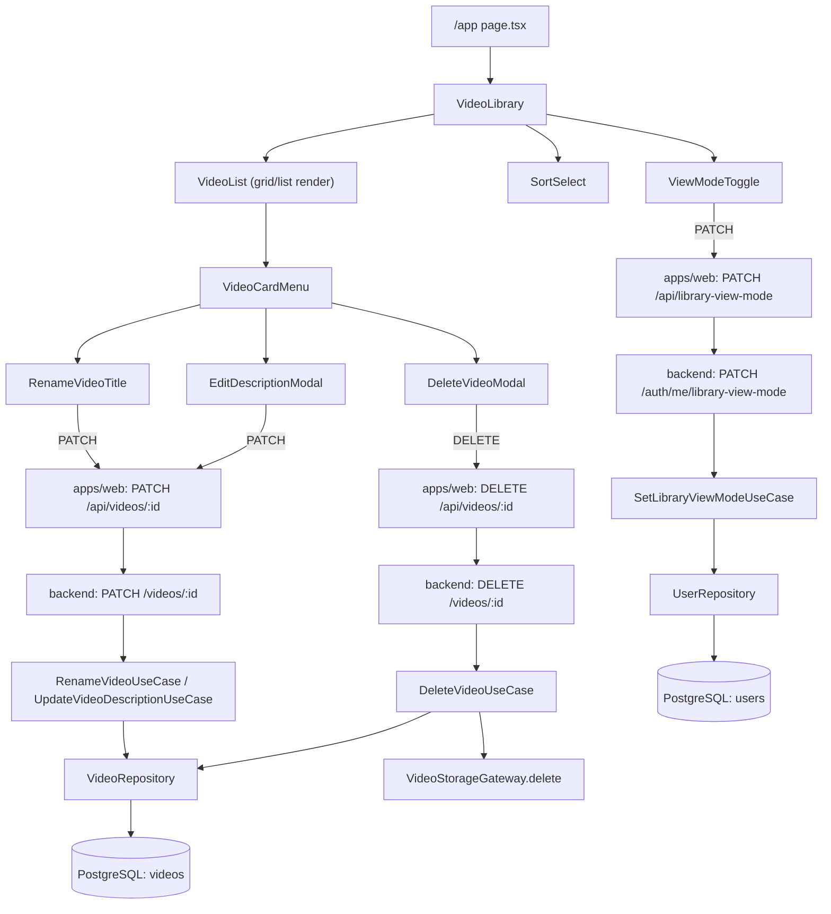

# Spec: F04. Video Library

## 1. Technical Overview

**What:** The real, permanent `/app` library — replacing F03's temporary placeholder wholesale — that lists every video owned by the authenticated user, offers a grid/list toggle with a per-account persistent preference, sorts by recency/oldest/title, renders a status badge per video, and lets the user rename a title, edit a description, or permanently delete a video (with a debounced confirmation modal). It reuses F03's `Video` aggregate, storage gateway, and upload UI verbatim and extends them with the read/update/delete surface this feature owns.

**Why:** F04 is the home screen of the product and the first feature whose PRD scope is entirely about *managing* videos F03 already produced, rather than producing them. It depends only on F02 (session/auth plumbing) and F03 (the `Video` aggregate, its storage gateway, and its upload UI) — both already implemented — and delivers no new external integration.

**Scope:**

PRD Section 6 lists no `Core Scope` / `Full Scope additions` split for F04 (confirmed: the feature has a single `Capabilities` block only), so the entire feature as described is in scope — no scope question was needed.

**Included:**
- Real `/app` library page listing every video owned by the authenticated user, replacing F03's placeholder `VideoLibrary`/`VideoList` components
- Grid view (thumbnail cards) and list view (compact rows), toggled per PRD Experience, with the choice persisted on the user's account (see Technical Decisions) so it survives logout/login and different browsers
- Sort: most recent (default), oldest, title A–Z
- Status badge on every card/row for all five statuses: `validating`, `transcribing`, `summarizing`, `ready`, `failed`
- Inline rename (1–200 non-empty characters) and a description-edit modal (up to 2000 characters)
- Delete with a confirmation modal whose Delete button is disabled for 1 second after opening; permanently removes the video row, its stored file, and its stored thumbnail file
- Empty-library state (illustration + text + the existing upload drop zone)
- Continuing to host the drop zone/upload queue components F03 already built (unchanged, just re-composed into the new page)

**Excluded (owned by other features, or not required by any F04 PRD §9 acceptance criterion):**
- Deletion of transcription rows, summary rows, and folder/tag association rows — those tables do not exist yet (owned by F07, F05, F06 respectively). F04's own migration cannot delete rows in tables that do not exist. When those features add their tables, their own `videoId` foreign keys are expected to declare `onDelete: Cascade` (mirroring how F03 already set `onDelete: Cascade` on `Video.userId`), so a video's cascade-deletion of that data becomes automatic once those tables exist — this feature does not need to (and cannot) implement that part now
- The "retry" context-menu action — PRD Capabilities lists it, but re-entering a failed stage is F07's Background Processing Pipeline, which is not in F04's PRD §8 dependency closure (F04 depends only on F02, F03) and no PRD §9 acceptance criterion for F04 requires it. No retry affordance is rendered by this feature — shipping a button wired to a non-existent endpoint would be worse than omitting it
- Navigating to the video detail page's actual content (`/app/videos/{id}`'s player/transcription/summary layout) — that is F08's page. No F04 PRD §9 AC requires this feature to create even a placeholder route for it (unlike F03, which needed a placeholder `/app` to make its own upload ACs verifiable)
- Folders, tags, the notification panel, the player, transcription, summaries, admin aggregation (F05, F06, F11, F08, F09, F10, F12)

## 2. Architecture Impact

**Affected components:**
- `apps/backend/prisma/schema.prisma`, new migration — adds `libraryViewMode` to `User`
- `apps/backend/src/domain/video/` — `Video` entity gains `rename`/`updateDescription`; new `VideoTitle`/`VideoDescription` VOs; `VideoRepository` gains `delete`; `VideoQueries` gains a `sort` parameter and a `description` field
- `apps/backend/src/domain/user/` — `User` entity gains `libraryViewMode`; new `LibraryViewMode` VO
- `apps/backend/src/usecase/video/` — new `RenameVideoUseCase`, `UpdateVideoDescriptionUseCase`, `DeleteVideoUseCase`; `ListVideosUseCase` extended for sort
- `apps/backend/src/usecase/user/` — new `SetLibraryViewModeUseCase`; `GetCurrentUserUseCase` extended to return `libraryViewMode`
- `apps/backend/src/infra/http/video/` — new `update.handler.ts` (rename/description), `delete.handler.ts`; `list.handler.ts` extended for `sort`
- `apps/backend/src/infra/http/auth/` — new `set-library-view-mode.handler.ts`; `me.handler.ts` extended
- `apps/backend/src/infra/repository/video/`, `apps/backend/src/infra/repository/user/` — Prisma + in-memory implementations extended for the above
- `apps/backend/src/main.ts` — wires the new use cases/handlers
- `apps/web/components/` — `video-list.tsx` reworked into grid/list-aware rendering; new `view-mode-toggle.tsx`, `sort-select.tsx`, `video-card-menu.tsx`, `rename-video-title.tsx`, `edit-description-modal.tsx`, `delete-video-modal.tsx`, `empty-library-state.tsx`
- `apps/web/lib/video-client.ts` — new, client-side calls for rename/description/delete/sort/view-mode
- `apps/web/app/api/videos/[id]/route.ts` — new proxy Route Handler (`PATCH`, `DELETE`)
- `apps/web/app/api/library-view-mode/route.ts` — new proxy Route Handler (`PATCH`)
- `apps/web/app/app/page.tsx`, `apps/web/components/video-library.tsx` — modified, compose the real library experience in place of F03's placeholder



## 3. Technical Decisions

| Decision | Chosen Approach | Alternative Considered | Trade-off |
|----------|----------------|----------------------|-----------|
| Where the grid/list preference lives | A `libraryViewMode` column on `User` ("grid" default \| "list"), read/written through `GET /auth/me` (extended) and a new `PATCH /auth/me/library-view-mode` | Browser `localStorage` | PRD's AC says the choice "persists across sessions" and Capabilities calls it "per-user persistent choice" — account-level phrasing, not per-browser. `localStorage` would not survive a different browser/device and contradicts "per-user" |
| Rename + description-edit as one endpoint | Single `PATCH /videos/:id` accepting a partial body (`{ title? }`, `{ description? }`, or both) | Two separate endpoints (`PATCH /videos/:id/title`, `PATCH /videos/:id/description`) | PRD treats them as two distinct UI affordances (inline field vs. modal) but they are the same "edit this video's metadata" operation on the same aggregate; one endpoint avoids near-duplicate handlers while each PRD-driven UI flow still sends only the field it owns |
| Deletion semantics | Hard delete: the `Video` row, its stored file, and its stored thumbnail file are all permanently removed in one operation; no soft-delete column | Soft delete (`deletedAt` timestamp) | PRD Section 7 explicitly lists "Archive tiers or a soft-delete trash can (deletion is immediate and permanent after confirmation)" as Out of Scope |
| "Already deleted" message on concurrent delete | Reuse the existing `VideoNotFoundError` (404) from F03 — a second `DELETE` naturally 404s once the row is gone — and let the frontend's delete-flow interpret a 404 received *while a delete confirmation was already open* as "This video has already been deleted" | A new dedicated `VideoAlreadyDeletedError`/409 | The observable end-state (no such video) is identical to "not found"; inventing a second error class for the same underlying fact adds a distinction the API doesn't need. The UX-specific wording is a presentation concern the frontend already owns (compare F02's frontend translating a generic 401 into "Invalid email or password") |
| Sort implementation | Server-side: `VideoQueries.listByUser` gains a `sort: "recent" \| "oldest" \| "title"` parameter (default `"recent"`), applied before pagination | Client-side sorting of the fetched page | Sorting after pagination would sort only the current page, not the whole library; this project's existing convention (F03) already puts read-shape decisions in `VideoQueries`, not the use case or the client |
| Rename/description validation | New `VideoTitle` (1–200 chars, non-empty after trim) and `VideoDescription` (≤2000 chars) value objects, mirroring the project's existing VO-per-invariant style (`Email`, `HashedPassword`, `VideoStatus`) | Inline validation inside the use case | Keeps invariants next to the domain concept they protect and matches every prior VO in this codebase |
| Immutable update methods | `Video.rename(title)` and `Video.updateDescription(description)` each return a new `Video` instance (all fields carried over except the changed one), consistent with the entity's existing all-`readonly` fields | Mutable setters | `Video`'s constructor already treats every field as `readonly`; introducing mutation here would be the only mutable path on an otherwise immutable entity |
| Retry action | Not built by this feature — no button rendered for it | Render a disabled/placeholder "Retry" button | PRD Capabilities mentions it, but its real behavior is F07's (outside F04's dependency closure) and no F04 PRD §9 AC requires it; a visible-but-non-functional control would misrepresent working functionality |
| Video detail navigation | Not built by this feature — clicking a card has no destination in this feature's scope | Add a placeholder `/app/videos/[id]` route, mirroring F03's placeholder-page tactic | Unlike F03 (whose own ACs needed a `/app` placeholder to be verifiable), no F04 PRD §9 AC requires navigating anywhere on click; F08 owns that page and its own contract will require it to exist |
| Frontend visual theme | Continue the "Ember" (light) design tokens already shipped by F01/F02/F03 (`apps/web/app/globals.css`, `VMButton`, `VMBadge`, panel/border/shadow tokens) for grid card layout, list-row layout, `VMStatus` status pill, and sort/view-toggle controls | Switch to Option B ("Signal", dark) from `docs/design/design-system-pages/` per `CLAUDE.md`'s stated mandate | `CLAUDE.md` mandates Option B "Signal" (dark), but F01/F02/F03 already shipped and documented (in F03's own PR) an "Ember" (light) theme instead — a pre-existing, already-flagged deviation. Following the already-shipped tokens keeps F04 visually consistent with the rest of the live app rather than mixing a dark-themed library page into an otherwise light product; the three new modals reuse the same established token set rather than inventing a new visual language |
| E2E test tooling | Continue Playwright under `apps/web/tests/e2e/`, the same documented departure F03 already recorded from `AGENTS.md`'s newer "use playwright-cli" instruction | Install/author a `playwright-cli` skill first | No such skill exists in this project's `.claude/skills/` as of this feature (checked directly); F02/F03 already ship real, green Playwright specs in exactly the folder `AGENTS.md` says not to create. This feature continues the established, working convention rather than blocking on an unresolved project-level conflict already flagged once |

**Assumptions (auto-accepted — "auto-accept" mode; no interactive interview was run; every open decision below applies an existing project convention, the PRD's own text, or an industry-standard default):**
- Scope: PRD Section 6 has no `Core Scope`/`Full Scope additions` split for F04 — confirmed by reading the section — so the full feature is in scope; no scope question applies (per Auto-Accept Policy, this is the "neither block present" case, not the "pick Core" case)
- Quality gates: detected automatically from `scripts/run-gates.mjs` (the consolidated `npm run gates` backend audit), `apps/backend/package.json` (`test`, `build`), and `apps/web/package.json` (`lint`, `typecheck`, `test`, `test:e2e`, `build`) — the identical set F02 and F03's contracts already declared. Included in `contract.md` without asking, per the Auto-Accept Policy row for quality gates
- Persistent-state seeding convention: reuses F02's `apps/backend/prisma/seed.ts` mechanism (upsert-based). This feature does not add new rows to the shared seed script (its own PRD §9 ACs are about *managing* videos a user already has, not about pre-existing library contents beyond what individual contract items need, which are seeded per the contract's own Persistent State section)
- Static-input/fixture convention: reuses `video-samples/tiny-valid.mp4`, the fixture F03 already established at the project-declared `video-samples/` root directory — no new fixture files are introduced
- Test configuration convention: reuses `apps/backend/.env.test` / `apps/web/.env.test`, as established by F02/F03
- Mock/fake convention: reuses this project's existing "fake gateway with a configurable failure mode" pattern (e.g. F03's `fake-thumbnail.gateway.ts`) for the one item that needs to simulate a storage deletion failure
- `libraryViewMode` values are the closed set `"grid" | "list"`, matching the PRD's only two named viewing modes; no third mode is anticipated
- Sort field default and options (`recent` default, `oldest`, `title`) are taken verbatim from PRD Capabilities ("Sort options: most recent (default), oldest, title A–Z") — no invented option was added
- No pagination-size decision was open: F03 already established `PageInput`/`PageOutput` with a default `pageSize` of 20 and a cap of 100 (see `apps/backend/src/infra/http/video/list.handler.ts`); this feature reuses that unchanged
- Title/description length bounds (1–200, ≤2000) are taken verbatim from PRD Capabilities; no additional format restriction (e.g. character allow-list) is invented beyond what the PRD states
- The empty-state illustration is treated as any other static UI asset (an inline SVG or icon), not as a design decision requiring interview — the PRD's own text for this AC ("shows an illustration with the text…") is fully objective and testable without a subjective placeholder item

## 4. Component Overview

**Backend:**

| File Path | New/Modified | Purpose | Key Responsibilities |
|-----------|--------------|---------|---------------------|
| `apps/backend/prisma/schema.prisma` | Modified | Adds `libraryViewMode` to `User` | See Data Model |
| `apps/backend/prisma/migrations/<ts>_add_library_view_mode_to_users/migration.sql` | New | Adds the column with a `'grid'` default | — |
| `apps/backend/src/domain/user/library-view-mode.vo.ts` | New | `LibraryViewMode` VO | `"grid" \| "list"`, mirrors `VideoStatus`'s closed-set pattern |
| `apps/backend/src/domain/user/user.entity.ts` | Modified | Adds `libraryViewMode` field | New `changeLibraryViewMode(mode): User` immutable-update method |
| `apps/backend/src/domain/user/errors.ts` | Modified | Adds `InvalidLibraryViewModeError` | 422 |
| `apps/backend/src/domain/video/video-title.vo.ts` | New | `VideoTitle` VO | 1–200 chars, non-empty after trim |
| `apps/backend/src/domain/video/video-description.vo.ts` | New | `VideoDescription` VO | ≤2000 chars |
| `apps/backend/src/domain/video/video.entity.ts` | Modified | Adds `rename`/`updateDescription` | Each returns a new immutable instance |
| `apps/backend/src/domain/video/errors.ts` | Modified | Adds `EmptyTitleError`, `TitleTooLongError`, `DescriptionTooLongError` | 422 each |
| `apps/backend/src/domain/video/video.repository.ts` | Modified | Adds `delete(id): Promise<void>` | — |
| `apps/backend/src/domain/video/video.queries.ts` | Modified | Adds `sort` to the list call; `description` on `VideoListItem` | — |
| `apps/backend/src/usecase/video/rename-video.usecase.ts` + `.dto.ts` | New | Renames, ownership-checked | Throws `VideoNotFoundError` if not owned |
| `apps/backend/src/usecase/video/update-video-description.usecase.ts` + `.dto.ts` | New | Updates description, ownership-checked | — |
| `apps/backend/src/usecase/video/delete-video.usecase.ts` + `.dto.ts` | New | Deletes row, then best-effort deletes file + thumbnail | File-removal failure does not stop the row from being removed |
| `apps/backend/src/usecase/video/list-videos.usecase.ts` + `.dto.ts` | Modified | Accepts and forwards `sort` | — |
| `apps/backend/src/usecase/user/set-library-view-mode.usecase.ts` + `.dto.ts` | New | Persists the preference | Ownership is implicit (`actorId` only) |
| `apps/backend/src/usecase/user/get-current-user.usecase.ts` + `.dto.ts` | Modified | Adds `libraryViewMode` to the output | — |
| `apps/backend/src/infra/repository/video/video.prisma-repository.ts` | Modified | Implements `delete` | `prisma.video.delete` |
| `apps/backend/src/infra/repository/video/video.in-memory-repository.ts` | Modified | Implements `delete` | Fake |
| `apps/backend/src/infra/queries/video/video.prisma-queries.ts` | Modified | Applies `sort` to `ORDER BY`; returns `description` | — |
| `apps/backend/src/infra/queries/video/video.in-memory-queries.ts` | Modified | Applies `sort` in-memory | Fake |
| `apps/backend/src/infra/repository/user/user.prisma-repository.ts` | Modified | Persists `libraryViewMode` | — |
| `apps/backend/src/infra/repository/user/user.in-memory-repository.ts` | Modified | Persists `libraryViewMode` | Fake |
| `apps/backend/src/infra/repository/user/user.mapper.ts` | Modified | Maps `libraryViewMode` | — |
| `apps/backend/src/infra/http/video/update.handler.ts` | New | `PATCH /videos/:id` | Delegates to rename and/or description use case depending on which fields are present |
| `apps/backend/src/infra/http/video/delete.handler.ts` | New | `DELETE /videos/:id` | Calls `DeleteVideoUseCase` |
| `apps/backend/src/infra/http/video/list.handler.ts` | Modified | Parses `sort` query param | — |
| `apps/backend/src/infra/http/video/video.routes.ts` | Modified | Registers `PATCH`/`DELETE /videos/:id` | Both `requiresAuth: true` |
| `apps/backend/src/infra/http/auth/me.handler.ts` | Modified | Includes `libraryViewMode` | — |
| `apps/backend/src/infra/http/auth/set-library-view-mode.handler.ts` | New | `PATCH /auth/me/library-view-mode` | Calls `SetLibraryViewModeUseCase` |
| `apps/backend/src/infra/http/auth/auth.routes.ts` | Modified | Registers the new route | `requiresAuth: true` |
| `apps/backend/src/main.ts` | Modified | Wires every new use case/handler | — |

**Frontend:**

| File Path | New/Modified | Purpose | Key Responsibilities |
|-----------|--------------|---------|---------------------|
| `apps/web/app/api/videos/[id]/route.ts` | New | Proxy Route Handler | `PATCH` and `DELETE`, forwarding the bearer token |
| `apps/web/app/api/library-view-mode/route.ts` | New | Proxy Route Handler | `PATCH`, forwarding the bearer token |
| `apps/web/app/app/page.tsx` | Modified | Reads `libraryViewMode` from `/auth/me` and passes it as the initial view mode | Also passes the initial `sort` (default `recent`) |
| `apps/web/components/video-library.tsx` | Modified | Orchestrates view mode, sort, and the video list together with the existing upload queue | Owns the delete/rename/description modal state |
| `apps/web/components/video-list.tsx` | Modified | Renders either the grid or the list layout depending on `viewMode` | Renders the status badge, and the per-card/row context menu |
| `apps/web/components/video-card-menu.tsx` | New | Context menu (rename, edit description, delete) | Per PRD's "Video card actions via context menu" |
| `apps/web/components/rename-video-title.tsx` | New | Inline editable title | Validates non-empty client-side before submit; shows the server's inline error otherwise |
| `apps/web/components/edit-description-modal.tsx` | New | Textarea modal, ≤2000 chars | — |
| `apps/web/components/delete-video-modal.tsx` | New | Confirmation modal | Delete button `disabled` for 1 second after the modal opens |
| `apps/web/components/empty-library-state.tsx` | New | Illustration + "Upload your first video to get started" + the drop zone | Rendered instead of `video-list.tsx` when there are zero videos |
| `apps/web/components/view-mode-toggle.tsx` | New | Grid/list switch | Calls the view-mode proxy on click |
| `apps/web/components/sort-select.tsx` | New | Sort dropdown | Re-fetches the list with the chosen `sort` |
| `apps/web/lib/video-client.ts` | New | Client-side calls for rename/description/delete/view-mode/sorted-list | Mirrors `upload-client.ts`'s role for this feature's own mutations |

**Database:**

- `users` table gains one column (`libraryViewMode`) — see Data Model. No new table.

## 5. API Contracts

All endpoints require `Authorization: Bearer <sessionToken>` and are called only through `apps/web`'s proxy, per the established pattern.

### `PATCH /videos/:id` (protected)

Request body (at least one field):
```json
{ "title": "Lecture 05 (final cut)", "description": "Covers attention and positional encodings." }
```

Success `200`:
```json
{
  "id": "…",
  "title": "Lecture 05 (final cut)",
  "description": "Covers attention and positional encodings.",
  "status": "ready",
  "thumbnailUrl": "/videos/<id>/thumbnail",
  "sizeBytes": 1503238553,
  "durationSeconds": 2892,
  "uploadedAt": "2026-01-01T00:00:00.000Z"
}
```

Errors:
- `422 INVALID_TITLE` — `title` present but empty/whitespace, or over 200 characters
- `422 DESCRIPTION_TOO_LONG` — `description` present and over 2000 characters
- `404 VIDEO_NOT_FOUND` — no such video, or it does not belong to the caller

### `DELETE /videos/:id` (protected)

Success `204` (no body). The video row, its stored file, and its stored thumbnail file are all removed; a subsequent `GET /videos` never includes it again.

Errors:
- `404 VIDEO_NOT_FOUND` — no such video, it does not belong to the caller, or it was already deleted

### `GET /videos` (protected, extended)

New query parameter: `sort` — one of `recent` (default), `oldest`, `title`.

Success `200` (unchanged shape from F03, `description` now included per item):
```json
{
  "items": [
    { "id": "…", "title": "…", "description": "…", "status": "ready", "thumbnailUrl": "…", "sizeBytes": 1503238553, "durationSeconds": 2892, "uploadedAt": "…" }
  ],
  "page": 1,
  "pageSize": 20,
  "total": 1
}
```

### `GET /auth/me` (protected, extended)

Adds `libraryViewMode` to the existing response:
```json
{ "id": "…", "name": "…", "email": "…", "isAdmin": false, "libraryViewMode": "grid" }
```

### `PATCH /auth/me/library-view-mode` (protected)

Request:
```json
{ "viewMode": "list" }
```

Success `200`:
```json
{ "libraryViewMode": "list" }
```

Errors:
- `422 INVALID_LIBRARY_VIEW_MODE` — `viewMode` is not `"grid"` or `"list"`

### Frontend proxy

`apps/web/app/api/videos/[id]/route.ts` forwards `PATCH`/`DELETE` bodies and statuses unchanged. `apps/web/app/api/library-view-mode/route.ts` forwards the `PATCH` body/status unchanged. Both attach `Authorization: Bearer <token>` from the `videomax_session` cookie server-side — no token detail reaches the browser, matching every prior authenticated route in this project.

## 6. Data Model

```prisma
// apps/backend/prisma/schema.prisma (addition to the existing User model)
model User {
  // ...existing fields unchanged...
  libraryViewMode String @default("grid")
}
```

Notes:
- Stored as a plain string (not a Postgres enum), matching this project's existing choice for `Video.status` — `LibraryViewMode.create` is the single application-side validation point, so a future third mode needs no migration
- No changes to the `videos` table are required by this feature: `title`, `description`, `status`, `thumbnailPath` already exist (F03); `DeleteVideoUseCase` performs a hard `DELETE` of the row, not a column addition

## 7. Testing Strategy

**Test File Structure:**

| Test File | Test Type | Target | Coverage Goal |
|-----------|-----------|--------|---------------|
| `apps/backend/src/domain/video/video-title.vo.spec.ts` | Unit | `VideoTitle` VO | 90% |
| `apps/backend/src/domain/video/video-description.vo.spec.ts` | Unit | `VideoDescription` VO | 90% |
| `apps/backend/src/domain/video/video.entity.spec.ts` | Unit | `rename`/`updateDescription` additions | 90% |
| `apps/backend/src/domain/user/library-view-mode.vo.spec.ts` | Unit | `LibraryViewMode` VO | 90% |
| `apps/backend/src/domain/user/user.entity.spec.ts` | Unit | `changeLibraryViewMode` addition | 90% |
| `apps/backend/src/usecase/video/rename-video.usecase.spec.ts` | Unit | `RenameVideoUseCase` (fakes) | 90% |
| `apps/backend/src/usecase/video/update-video-description.usecase.spec.ts` | Unit | `UpdateVideoDescriptionUseCase` (fakes) | 90% |
| `apps/backend/src/usecase/video/delete-video.usecase.spec.ts` | Unit | `DeleteVideoUseCase` (fakes, including a storage-failure fake) | 90% |
| `apps/backend/src/usecase/video/list-videos.usecase.spec.ts` | Unit | Sort forwarding | 90% |
| `apps/backend/src/usecase/user/set-library-view-mode.usecase.spec.ts` | Unit | `SetLibraryViewModeUseCase` (fakes) | 90% |
| `apps/backend/src/infra/http/video/video.routes.spec.ts` | Integration | `PATCH`/`DELETE /videos/:id`, `GET /videos?sort=` | 85% |
| `apps/backend/src/infra/http/auth/me.handler.spec.ts` | Integration | `libraryViewMode` round trip | 85% |
| `apps/web/tests/unit/video-list.test.tsx` | Component | Grid/list rendering, status badges | 85% |
| `apps/web/tests/unit/rename-video-title.test.tsx` | Component | Inline rename, empty-title rejection | 85% |
| `apps/web/tests/unit/delete-video-modal.test.tsx` | Component | 1-second disabled Delete button | 85% |
| `apps/web/tests/unit/video-client.test.ts` | Unit | Rename/description/delete/view-mode/sort request shapes | 90% |
| `apps/web/tests/e2e/library.spec.ts` | E2E | Rename, delete, and view-mode persistence against the real backend | Key user flows |

**Test functions:**

| Test Function | Description | Assertions |
|---------------|-------------|------------|
| `renames the video when the title is valid` (`rename-video.usecase.spec.ts`) | Happy path | Repository holds the updated title |
| `rejects an empty or whitespace-only title` (`rename-video.usecase.spec.ts`) | Domain guard | Throws before any repository write |
| `rejects a title over 200 characters` (`rename-video.usecase.spec.ts`) | Domain guard | Throws before any repository write |
| `throws VideoNotFoundError for a video the caller does not own` (`rename-video.usecase.spec.ts`) | Ownership check | No write occurs |
| `updates the description within the 2000-character bound` (`update-video-description.usecase.spec.ts`) | Happy path | Repository holds the updated description |
| `rejects a description over 2000 characters` (`update-video-description.usecase.spec.ts`) | Domain guard | Throws before any repository write |
| `deletes the row and the stored files on the happy path` (`delete-video.usecase.spec.ts`) | Happy path | Repository no longer returns the video; storage gateway's `delete` was called for both keys |
| `still deletes the row when the storage gateway's delete fails` (`delete-video.usecase.spec.ts`) | Resilience | Repository no longer returns the video despite the storage error |
| `throws VideoNotFoundError for a video the caller does not own or that no longer exists` (`delete-video.usecase.spec.ts`) | Ownership / already-deleted | No repository write occurs |
| `applies sort=recent, oldest, and title in the query layer` (`list-videos.usecase.spec.ts`) | Sort forwarding | The queries fake receives the requested sort and returns items in that fake's own order |
| `persists a valid view mode` (`set-library-view-mode.usecase.spec.ts`) | Happy path | Repository holds the new value |
| `rejects a value outside grid/list` (`set-library-view-mode.usecase.spec.ts`) | Domain guard | Throws before any repository write |
| `renders a grid card per video with the correct status badge` (`video-list.test.tsx`) | Rendering | One card/row per fixture video; badge text matches its status |
| `switches to the compact row layout when viewMode is list` (`video-list.test.tsx`) | Rendering | List-specific columns are present; grid-specific card layout is not |
| `disables the Delete button for one second after opening` (`delete-video-modal.test.tsx`) | Timing guard | Button is `disabled` immediately; enabled after the 1-second timer fires |
| `rename persists across reload` (`library.spec.ts`, E2E) | Full flow | After reload, the renamed title is still shown |
| `delete removes the video permanently` (`library.spec.ts`, E2E) | Full flow | After reload, the deleted video's card is gone |
| `view mode persists across logout and login` (`library.spec.ts`, E2E) | Full flow | After logging out and back in, the previously chosen view mode is applied without re-toggling |
