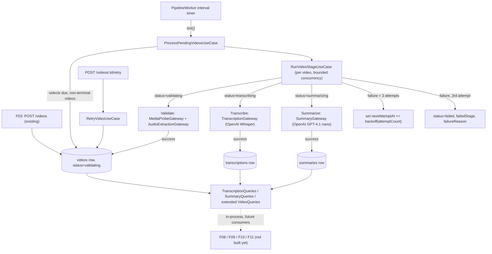

# Spec: F07. Background Processing Pipeline

## 1. Technical Overview

**What:** A backend-only orchestration layer that advances every uploaded video through `validating` → `transcribing` → `summarizing` → `ready` without any manual trigger. An in-process polling worker periodically scans for videos due for processing, runs the stage matching each video's current status, calls out to OpenAI (Whisper for transcription, GPT-4.1 nano for summarization) and to `ffmpeg`/`ffprobe` for validation and audio extraction, persists the results, and applies a fixed retry/backoff policy (3 attempts per stage, 1m/5m/15m) before marking a video `failed` with a stage-specific reason. A `POST /videos/{id}/retry` endpoint lets a `failed` video's attempt counter be reset and its failed stage re-entered.

**Why:** F07 is the direct continuation of F03: F03 leaves every video in `validating` with a stored file and probed duration, and every later feature that renders transcription (F08, F09), summary (F10), or live status (F04, F11) depends on the data this pipeline produces. It depends only on F03 (PRD Section 8) — no other feature needs to exist for F07 to run end-to-end.

**Scope:**

The PRD's F07 entry has neither a `Core Scope` nor a `Full Scope additions` block, so the full feature as described in Capabilities/Experience/Error Handling is in scope (no scope question was needed).

**Included:**
- An in-process polling worker (no external queue/broker) that ticks on a configurable interval, selects videos whose `nextAttemptAt` is due and whose status is not terminal (`ready`/`failed`), and processes up to a configured number of them concurrently per tick
- Validate stage: extends the existing media probe to also confirm the file is readable and its codecs are supported (in addition to F03's existing duration probe), enforces the 2-hour ceiling, and extracts the audio track for the transcribe stage to consume
- Transcribe stage: sends the extracted audio to an OpenAI Whisper-backed gateway with automatic language detection; persists ordered segments (start/end timestamps + text) and the detected language code
- Summarize stage: sends the concatenated transcript to an OpenAI GPT-4.1 nano-backed gateway with a structured prompt; parses and persists an overview paragraph and an ordered list of key-topic bullets
- Retry/backoff bookkeeping on the `Video` record: attempt counter, next-eligible-attempt timestamp, the stage a video failed at, and a human-readable failure reason
- `POST /videos/{id}/retry`: the backend action a failed video's "Retry" affordance calls — resets the attempt counter and re-enters the recorded failed stage
- Worker-restart recovery: because progress within a stage is never partially persisted, any process restart naturally re-enters the current stage from the beginning for every non-terminal video — no separate "in-progress" lock state is needed
- Read interfaces (extended `VideoQueries`, new `TranscriptionQueries`, new `SummaryQueries`) that downstream features (F08, F09, F10, F11) will call in-process to read stage/attempt/transcription/summary data — this feature ships the interfaces and their implementations; it does not ship any UI that renders them
- New gateway interfaces, each with a Fake (configurable success/failure) for tests and a real implementation, following F03's `MediaProbeGateway`/`ThumbnailGateway` pattern: `TranscriptionGateway` (OpenAI Whisper), `SummaryGateway` (OpenAI GPT-4.1 nano), `AudioExtractionGateway` (`ffmpeg`); plus an extension of the existing `MediaProbeGateway`

**Excluded (owned by other features):**
- Rendering the current stage/attempt count as a status badge, detail-page banner, or notification-panel entry (F04, F08, F11) — F07 only makes the data available; it renders nothing
- The "Retry" button itself and its placement in the library or video detail header (F04, F08) — F07 owns only the backend action the button calls
- Transcription panel rendering, click-to-seek, auto-scroll (F08); in-video search (F09); summary section rendering (F10); notification polling UI (F11)
- Any new upload-time behavior — F03's upload flow, formats, size limits, and thumbnailing are unchanged

## 2. Architecture Impact

**Affected components:**
- `apps/backend/prisma/schema.prisma`, new migration — new columns on `Video` (`attemptCount`, `nextAttemptAt`, `failedStage`, `failureReason`, `audioStorageKey`); new `Transcription` and `Summary` tables
- `apps/backend/src/domain/video/video.entity.ts` — extended with the new attempt/stage/failure fields and stage-transition methods
- `apps/backend/src/domain/video/media-probe.gateway.ts` — extended return shape (`isReadable`, `hasSupportedCodecs` alongside the existing `durationSeconds`)
- `apps/backend/src/domain/video/audio-extraction.gateway.ts` — new gateway interface
- `apps/backend/src/domain/video/transcription.gateway.ts`, `summary.gateway.ts` — new gateway interfaces (OpenAI-backed)
- `apps/backend/src/domain/video/transcription.entity.ts`, `transcription.repository.ts`, `transcription.queries.ts` — new
- `apps/backend/src/domain/video/summary.entity.ts`, `summary.repository.ts`, `summary.queries.ts` — new
- `apps/backend/src/domain/video/video.queries.ts` — extended `VideoListItem`/new `VideoProcessingStatus` shape with `attemptCount`/`failureReason`
- `apps/backend/src/domain/video/errors.ts` — new `VideoNotFailedError`
- `apps/backend/src/usecase/pipeline/process-pending-videos.usecase.ts` — the worker tick's unit of work: selects due videos, runs them with bounded concurrency
- `apps/backend/src/usecase/pipeline/run-video-stage.usecase.ts` — runs the stage matching a single video's current status, applies success/retry/failure transitions
- `apps/backend/src/usecase/pipeline/retry-video.usecase.ts` — the `Retry` action
- `apps/backend/src/infra/gateway/openai-whisper-transcription.gateway.ts`, `fake-transcription.gateway.ts` — new
- `apps/backend/src/infra/gateway/openai-summary.gateway.ts`, `fake-summary.gateway.ts` — new
- `apps/backend/src/infra/gateway/ffmpeg-audio-extraction.gateway.ts`, `fake-audio-extraction.gateway.ts` — new
- `apps/backend/src/infra/gateway/ffprobe-media-probe.gateway.ts`, `fake-media-probe.gateway.ts` — modified, extended return shape
- `apps/backend/src/infra/repository/transcription/`, `infra/repository/summary/` — new Prisma + in-memory repositories
- `apps/backend/src/infra/queries/transcription/`, `infra/queries/summary/` — new Prisma + in-memory queries
- `apps/backend/src/infra/worker/pipeline-worker.ts` — new, owns the timer loop and exposes a directly-invocable tick method
- `apps/backend/src/infra/http/video/retry.handler.ts` — new handler; `video.routes.ts` — modified, adds the retry route
- `apps/backend/src/config/env.ts` — modified, adds `openaiApiKey`, `pipelinePollIntervalMs`, `pipelineWorkerConcurrency`
- `apps/backend/src/main.ts` — modified, wires the new gateways/repositories/queries/use cases/handler and starts the worker alongside the HTTP server
- `apps/backend/package.json` — modified, adds the official `openai` SDK dependency



## 3. Technical Decisions

| Decision | Chosen Approach | Alternative Considered | Trade-off |
|----------|----------------|----------------------|-----------|
| Background processing mechanism | An in-process polling worker: a `PipelineWorker` runs a `setInterval` loop calling `ProcessPendingVideosUseCase.execute()` on a configurable interval (`PIPELINE_POLL_INTERVAL_MS`); eligibility and scheduling are DB-backed via `nextAttemptAt` on `Video`, no separate queue/broker | A real job-queue library (BullMQ + Redis, Agenda + MongoDB, pg-boss) | The codebase has zero queue/broker dependency today and this is a single-process Node monolith; introducing Redis/Mongo purely to schedule three DB-visible retries is disproportionate. `nextAttemptAt` is the industry-standard "poll the table for due rows" primitive for this scale, and it costs no new infrastructure — only a documented new-technology decision (see Assumptions) if a real queue is ever warranted later |
| Worker deployment topology | The worker's timer starts inside the same process as the HTTP server (`main.ts`'s `start()`), alongside `app.listen()` | A separate `worker.ts` entrypoint/process | No process-orchestration layer (no separate deploy target, no supervisor) exists yet in this project; running the worker in-process is the simplest option that still satisfies every PRD requirement (auto-pickup, concurrency, restart recovery), and the tick logic is exposed as a directly-callable method so it is exercisable independently of the timer in tests |
| Concurrency bound | `ProcessPendingVideosUseCase` selects up to `PIPELINE_WORKER_CONCURRENCY` due videos per tick and processes them with `Promise.all`, no third-party concurrency-limiter library | `p-limit` or similar | The concurrency count is a fixed, small, config-driven number (query `LIMIT`), so no dynamic limiter is needed — the SQL `LIMIT` clause already bounds the batch size |
| Retry/backoff storage | Fixed backoff schedule `[60_000, 300_000, 900_000]` ms (1m/5m/15m) as a domain constant; `Video.nextAttemptAt` and `Video.attemptCount` persist scheduling state; `Video.failedStage` records which stage to re-enter on retry | Configurable backoff via env vars | PRD states exact values (1m/5m/15m, 3 attempts) as a fixed business rule, not an operator setting — hardcoding avoids a config knob nothing in the PRD asks for |
| Validate-stage failures are terminal, not retried | A duration-over-2-hours or unreadable-file result fails the video immediately (single attempt, no backoff, `attemptCount` stays 0) | Apply the same 3-attempt retry policy to validate failures | PRD's Error Handling explicitly scopes automatic retry to "network, provider, transient error" on transcribe/summarize; the validate-stage error bullets describe deterministic content problems (a file that is 3 hours long stays 3 hours long on attempt 2) with no retry language attached — retrying would only waste 2 backoff cycles before an identical failure |
| Partial success (transcription kept after summary's final failure) | `Transcription` is a separate table/aggregate from `Video`; failing the summarize stage leaves the existing transcription row untouched | Store transcription inline as JSON on `Video` and null it out on any failure | PRD's Error Handling explicitly requires "keep the transcription available... once a retry eventually succeeds" after summarize fails permanently — a separate row that summarize-stage failures never touch satisfies this without extra guard logic |
| Transcription/summary storage shape | `Transcription` (one row per video: `language`, `segments` as an ordered JSON array of `{startSeconds, endSeconds, text}`) and `Summary` (one row per video: `overview` text, `keyTopics` as an ordered JSON string array) | A normalized `TranscriptionSegment` child table with one row per segment | A video's segments are always read/written as one ordered unit (never queried or paginated individually per the PRD), so one JSON column avoids N-row inserts per video and keeps ordering trivial (array order = presentation order) without a redundant `sortOrder` column |
| `MediaProbeGateway` extension | Extend the existing interface's return shape to add `isReadable: boolean` and `hasSupportedCodecs: boolean` alongside the existing `durationSeconds`, rather than introducing a second, competing probe interface | A new, separate `ValidationProbeGateway` | F03's `probe()` already does the one file-system/binary round trip this data comes from (`ffprobe`); asking twice would run `ffprobe` twice per video. The extension is additive — F03's own consumption (`durationSeconds` only) is unaffected |
| Audio extraction as its own gateway | New `AudioExtractionGateway.extract(videoPath, outputPath): Promise<{ audioPath: string }>`, `ffmpeg`-backed, invoked once during the validate stage; its output key is persisted on `Video.audioStorageKey` for the transcribe stage to read | Re-run extraction inside the transcribe stage each time; or send the original video file directly to Whisper | PRD explicitly assigns "extracts the audio track" to the validate stage's own Capabilities, distinct from probing; running it once and persisting the result avoids repeating a `ffmpeg` invocation on every transcribe retry attempt |
| OpenAI client | The official `openai` npm SDK, used by both the transcription gateway (Whisper endpoint) and the summary gateway (Chat Completions with `gpt-4.1-nano`) | Hand-rolled `fetch` calls against the OpenAI REST API | The official SDK is the industry-standard client for this provider, already handles multipart audio upload for Whisper and typed chat-completion requests, and needs no bespoke retry/parsing code this feature would otherwise have to maintain |
| Retry endpoint ownership | F07 owns `POST /videos/{id}/retry` — resets `attemptCount` to 0, clears `failedStage`/`failureReason`, sets `status` back to the recorded failed stage, and sets `nextAttemptAt` to now | Have F04/F08 (the UI-owning features) implement the endpoint themselves | The PRD lists "Retry action... resets the attempt counter and re-enters the failed stage" under F07's own Capabilities and Section 9 acceptance criteria — the button's placement is F04/F08's concern, but the state transition it triggers is pipeline business logic that belongs alongside the rest of this feature's stage-transition rules |
| Downstream read exposure | F07 ships the read interfaces (`TranscriptionQueries`, `SummaryQueries`, extended `VideoQueries`) that F08/F09/F10/F11 will call in-process when they are built; F07 does not add any new HTTP endpoint for these reads | Add `GET /videos/{id}/transcription` and `GET /videos/{id}/summary` HTTP endpoints now, anticipating F08/F10 | No consumer of such an endpoint exists yet inside F07's own dependency closure ({F03}); F08 (which does depend on F07) is a separate, not-yet-implemented feature whose own spec will decide its HTTP surface. Shipping the query interfaces now (not a guessed-at HTTP shape) is the smallest deliverable that satisfies the PRD's "Provides... used by F08/F09/F10/F11" language without speculatively designing another feature's API |

**Assumptions (auto-accepted — batch-mode auto-accept; no interactive interview was run; every open decision below applies an existing project convention, the PRD's own text, or an industry-standard default):**
- No `Core Scope`/`Full Scope additions` split exists for F07 in the PRD — the full feature is in scope; the scope question was skipped per the Auto-Accept Policy
- **New technology:** this is the first feature to introduce background/scheduled processing into the codebase. No queue library exists in `apps/backend/package.json` today. Per the Auto-Accept Policy row for "feature requires new technology," the in-process polling worker described in Technical Decisions is adopted and documented here rather than blocking on a design interview; no new runtime infrastructure dependency (Redis, message broker) is introduced, only the official `openai` npm SDK
- **UI-exclusion scoping call:** PRD's F07 Experience states the current stage/attempt count is "reflected in the library status badge, the detail page, and the notification panel in real time." Library badges are F04's surface, the detail page is F08's, the notification panel is F11's — none of those features are in F07's PRD Section 8 dependency closure ({F03}). F07's own deliverable stops at making the stage/attempt-count data correctly and promptly readable (via the extended `VideoQueries`); rendering it anywhere is explicitly out of this feature's scope. This spec's `Included`/`Excluded` blocks above encode that filter, and `contract.md`'s Coverage Manifest reflects it by covering the AC only through the read-interface behavior, never through a rendered badge or panel
- **Retry HTTP endpoint vs. F04/F08 ownership:** see Technical Decisions row "Retry endpoint ownership" — the endpoint is F07's because the state transition, not the button, is what PRD Section 9 asks this feature to guarantee
- Persistent-state seeding convention reuses F02/F03's established Prisma `seed.ts` mechanism plus direct repository inserts for the many attempt/stage permutations this feature's tests need (no video rows are added to the shared seed script; each test arranges its own fixture rows, mirroring F03/F04)
- Static-input/fixture convention reuses `video-samples/` (repository root), specifically the existing `video-samples/tiny-valid.mp4` fixture established by F03 — no new video file fixture is needed because every failure scenario this feature must exercise (over-duration, unreadable file, transient provider errors) is simulated through the already-established configurable-Fake-gateway convention rather than through exotic real media files
- Test configuration convention reuses `apps/backend/.env.test` (F02/F03's convention); `OPENAI_API_KEY` is read exclusively in `src/config/env.ts` per this project's `CLAUDE.md` rule and is sourced from the system environment — tests exercise the Fake gateways and never require a real key
- Mock/external-dependency convention reuses F03's configurable-Fake-gateway pattern (e.g. `FakeThumbnailGateway`'s constructor-configured success/failure) for every new gateway (`FakeTranscriptionGateway`, `FakeSummaryGateway`, `FakeAudioExtractionGateway`, and the extended `FakeMediaProbeGateway`)
- Quality gates: the full detected gate list is auto-included unchanged from `docs/F03-video-upload/contract.md`/`docs/F04-video-library/contract.md` (root `npm run gates`; backend test/build; frontend lint/typecheck/test/e2e/build) — F07 ships no frontend code, but the frontend gates remain part of the project-wide "ready" bar exactly as they do for every other feature's contract in this repo
- `PIPELINE_POLL_INTERVAL_MS` and `PIPELINE_WORKER_CONCURRENCY` follow the same "typed, validated, `config/env.ts`-only" pattern as F03's `STORAGE_ROOT`, with development defaults of `5000` (5s) and `2` respectively — no PRD text pins exact values, so industry-reasonable defaults for a low-traffic single-instance worker are used
- `Video.nextAttemptAt` defaults to "now" on creation so a freshly validated/uploaded video is immediately eligible, matching F03's existing "video starts in `validating`" behavior
- Ownership/authorization on the retry endpoint mirrors F03/F04's existing pattern: a video not owned by the authenticated user is masked as `404 VIDEO_NOT_FOUND`, never a `403`, to avoid disclosing existence of another user's resource (same rationale as `GetVideoThumbnailUseCase`)

## 4. Component Overview

**Backend:**

| File Path | New/Modified | Purpose | Key Responsibilities |
|-----------|--------------|---------|---------------------|
| `apps/backend/package.json` | Modified | Adds `openai` dependency | OpenAI Whisper + Chat Completions client |
| `apps/backend/src/config/env.ts` | Modified | Adds `openaiApiKey`, `pipelinePollIntervalMs`, `pipelineWorkerConcurrency` | Typed, validated at startup; the only file allowed to read these `process.env` vars |
| `apps/backend/prisma/schema.prisma` | Modified | New `Video` columns; new `Transcription`, `Summary` models | See Data Model |
| `apps/backend/prisma/migrations/<ts>_add_pipeline/migration.sql` | New | Creates the new columns/tables | — |
| `apps/backend/src/domain/video/video.entity.ts` | Modified | Adds attempt/stage/failure fields and stage-transition methods (`beginAttempt`, `succeedStage`, `scheduleRetry`, `failPermanently`) | Encapsulates every attempt/backoff rule so use cases never mutate raw fields |
| `apps/backend/src/domain/video/video-status.vo.ts` | Unmodified | Already declares `validating`/`transcribing`/`summarizing`/`ready`/`failed` (added ahead of time by F03) | Reused verbatim — no new status values |
| `apps/backend/src/domain/video/media-probe.gateway.ts` | Modified | Extends `probe()`'s return shape with `isReadable`, `hasSupportedCodecs` | Validate-stage readability/codec checks |
| `apps/backend/src/domain/video/audio-extraction.gateway.ts` | New | `AudioExtractionGateway` interface | `extract(videoPath, outputPath): Promise<{ audioPath: string }>` |
| `apps/backend/src/domain/video/transcription.gateway.ts` | New | `TranscriptionGateway` interface | `transcribe(audioPath): Promise<{ segments, languageCode }>` |
| `apps/backend/src/domain/video/summary.gateway.ts` | New | `SummaryGateway` interface | `summarize(fullText): Promise<{ overview, keyTopics }>` |
| `apps/backend/src/domain/video/transcription.entity.ts` + `transcription-id.vo.ts` | New | `Transcription` aggregate | One row per video; ordered segments + language |
| `apps/backend/src/domain/video/transcription.repository.ts` + `.queries.ts` | New | `TranscriptionRepository`/`TranscriptionQueries` interfaces | `findByVideoId`, `save` |
| `apps/backend/src/domain/video/summary.entity.ts` + `summary-id.vo.ts` | New | `Summary` aggregate | One row per video; overview + ordered key topics |
| `apps/backend/src/domain/video/summary.repository.ts` + `.queries.ts` | New | `SummaryRepository`/`SummaryQueries` interfaces | `findByVideoId`, `save` |
| `apps/backend/src/domain/video/video.queries.ts` | Modified | Adds `VideoProcessingStatus` shape and a `findProcessingStatus(videoId)` method | Exposes `status`, `attemptCount`, `failureReason` for downstream in-process reads |
| `apps/backend/src/domain/video/errors.ts` | Modified | Adds `VideoNotFailedError` | Retry attempted on a non-`failed` video |
| `apps/backend/src/domain/pipeline/backoff-schedule.ts` | New | The fixed `[60_000, 300_000, 900_000]` ms constant + a `nextDelayFor(attemptNumber)` helper | Single source of truth for the retry schedule |
| `apps/backend/src/usecase/pipeline/process-pending-videos.usecase.ts` + `.dto.ts` | New | The tick's unit of work | Selects up to `pipelineWorkerConcurrency` due videos, runs each through `RunVideoStageUseCase`, bounded by `Promise.all` |
| `apps/backend/src/usecase/pipeline/run-video-stage.usecase.ts` + `.dto.ts` | New | Runs one video's current stage once | Dispatches to the validate/transcribe/summarize logic by `video.status`; applies success/backoff/final-failure transitions via the entity's methods |
| `apps/backend/src/usecase/pipeline/retry-video.usecase.ts` + `.dto.ts` | New | The `Retry` action | Verifies ownership + `failed` status, resets attempt/failure state, re-enters `failedStage` |
| `apps/backend/src/infra/gateway/ffprobe-media-probe.gateway.ts` | Modified | Extended production implementation | Parses `ffprobe` output for readability/codec fields in addition to duration |
| `apps/backend/src/infra/gateway/fake-media-probe.gateway.ts` | Modified | Extended fake | Configurable duration, readability, codec-support results |
| `apps/backend/src/infra/gateway/ffmpeg-audio-extraction.gateway.ts` | New | `AudioExtractionGateway` production impl | `execFile('ffmpeg', ...)` extracting an audio-only file |
| `apps/backend/src/infra/gateway/fake-audio-extraction.gateway.ts` | New | Fake | Configurable success/failure; never shells out |
| `apps/backend/src/infra/gateway/openai-whisper-transcription.gateway.ts` | New | `TranscriptionGateway` production impl | Calls the OpenAI Whisper endpoint via the `openai` SDK |
| `apps/backend/src/infra/gateway/fake-transcription.gateway.ts` | New | Fake | Configurable segments/language/failure |
| `apps/backend/src/infra/gateway/openai-summary.gateway.ts` | New | `SummaryGateway` production impl | Calls OpenAI Chat Completions (`gpt-4.1-nano`) via the `openai` SDK; parses the structured response |
| `apps/backend/src/infra/gateway/fake-summary.gateway.ts` | New | Fake | Configurable overview/key topics/failure |
| `apps/backend/src/infra/repository/transcription/transcription.prisma-repository.ts` + `.mapper.ts` + `.in-memory-repository.ts` | New | `TranscriptionRepository` impls | Prisma-backed + in-memory fake |
| `apps/backend/src/infra/queries/transcription/transcription.prisma-queries.ts` + `.in-memory-queries.ts` | New | `TranscriptionQueries` impls | Prisma-backed + in-memory fake |
| `apps/backend/src/infra/repository/summary/summary.prisma-repository.ts` + `.mapper.ts` + `.in-memory-repository.ts` | New | `SummaryRepository` impls | Prisma-backed + in-memory fake |
| `apps/backend/src/infra/queries/summary/summary.prisma-queries.ts` + `.in-memory-queries.ts` | New | `SummaryQueries` impls | Prisma-backed + in-memory fake |
| `apps/backend/src/infra/worker/pipeline-worker.ts` | New | `PipelineWorker` | Owns the `setInterval` handle; `start()`/`stop()`; exposes `tick()` for direct invocation independent of the timer |
| `apps/backend/src/infra/http/video/retry.handler.ts` | New | `RetryHandler` | Calls `RetryVideoUseCase` with `req.user.id` and `req.params.id` |
| `apps/backend/src/infra/http/video/video.routes.ts` | Modified | Adds `POST /videos/:id/retry`, `requiresAuth: true` | — |
| `apps/backend/src/infra/http/index.ts` | Modified | Aggregates the new handler | — |
| `apps/backend/src/main.ts` | Modified | Wires every new gateway/repository/query/use case/handler; constructs `PipelineWorker` and calls `start()` alongside `app.listen()` | Composition root remains the only place concrete infra classes are wired |

**Frontend:** None — F07 ships no UI. Rendering the data this feature produces is owned by F04 (status badges), F08 (detail page/transcription panel), F10 (summary section), and F11 (notification panel), each outside F07's PRD Section 8 dependency closure.

**Database:**

- New columns on the existing `videos` table (`attemptCount`, `nextAttemptAt`, `failedStage`, `failureReason`, `audioStorageKey`) — see Data Model.
- New `transcriptions` table (one row per video) and `summaries` table (one row per video) — both owned entirely by this feature.

## 5. API Contracts

### `POST /videos/{id}/retry` (protected)

Requires `Authorization: Bearer <sessionToken>`, following F02/F03's existing pattern.

Success `200`:
```json
{
  "id": "…",
  "status": "transcribing",
  "attemptCount": 0
}
```
`status` echoes the stage the video re-enters (the stage it had failed at).

Errors:
- `404 VIDEO_NOT_FOUND` — no such video, or it does not belong to the authenticated user
- `422 VIDEO_NOT_FAILED` — the video's current status is not `failed`

## 6. Data Model

```prisma
// apps/backend/prisma/schema.prisma (additions)
model Video {
  // ...existing F03 fields unchanged...
  attemptCount    Int       @default(0)
  nextAttemptAt   DateTime  @default(now())
  failedStage     String?
  failureReason   String?
  audioStorageKey String?
  transcription   Transcription?
  summary         Summary?
}

model Transcription {
  id        String   @id @default(uuid())
  videoId   String   @unique
  language  String?
  segments  Json
  createdAt DateTime @default(now())
  updatedAt DateTime @updatedAt
  video     Video    @relation(fields: [videoId], references: [id], onDelete: Cascade)

  @@map("transcriptions")
}

model Summary {
  id        String   @id @default(uuid())
  videoId   String   @unique
  overview  String
  keyTopics Json
  createdAt DateTime @default(now())
  updatedAt DateTime @updatedAt
  video     Video    @relation(fields: [videoId], references: [id], onDelete: Cascade)

  @@map("summaries")
}
```

Notes:
- `attemptCount` and `nextAttemptAt` together are the entire scheduling primitive — a video is "due" when its status is not `ready`/`failed` and `nextAttemptAt <= now()`. An index on `(status, nextAttemptAt)` supports the worker's selection query at scale, though this is a performance note rather than a behavioral requirement.
- `failedStage` stores one of `validating`/`transcribing`/`summarizing` — the exact status value the video is set back to on retry. It is `null` whenever `status !== "failed"`.
- `segments` (`Transcription`) and `keyTopics` (`Summary`) are stored as JSON precisely because they are always read/written as one ordered unit — see Technical Decisions.
- `onDelete: Cascade` on both new tables mirrors the existing `videos.userId` FK behavior and F12's PRD requirement that deleting a user (or, per F04, a video) cascades to transcription and summary.

## 7. Testing Strategy

**Test File Structure:**

| Test File | Test Type | Target | Coverage Goal |
|-----------|-----------|--------|---------------|
| `apps/backend/src/domain/video/video.entity.spec.ts` | Unit | Extended `Video` entity — attempt/stage/backoff transition methods | 90% |
| `apps/backend/src/domain/pipeline/backoff-schedule.spec.ts` | Unit | `nextDelayFor` | 100% |
| `apps/backend/src/usecase/pipeline/run-video-stage.usecase.spec.ts` | Unit | `RunVideoStageUseCase` (fakes for every gateway/repo) — validate/transcribe/summarize success, retry, final-failure paths | 90% |
| `apps/backend/src/usecase/pipeline/process-pending-videos.usecase.spec.ts` | Unit | `ProcessPendingVideosUseCase` (fakes) — selection and concurrency bound | 90% |
| `apps/backend/src/usecase/pipeline/retry-video.usecase.spec.ts` | Unit | `RetryVideoUseCase` (fakes) — happy path, not-failed rejection, ownership rejection | 90% |
| `apps/backend/src/infra/gateway/ffprobe-media-probe.gateway.spec.ts` | Integration | Real `ffprobe`, extended readability/codec fields, against `video-samples/tiny-valid.mp4` | Key behavior |
| `apps/backend/src/infra/gateway/ffmpeg-audio-extraction.gateway.spec.ts` | Integration | Real `ffmpeg` audio extraction against the same fixture | Key behavior |
| `apps/backend/src/infra/http/video/retry.handler.spec.ts` | Integration | Handler + in-memory fakes | 85% |
| `apps/backend/src/infra/worker/pipeline-worker.spec.ts` | Integration | `start()`/`stop()`/`tick()` lifecycle against in-memory fakes | Key behavior |

**Test functions:**

| Test Function | Description | Assertions |
|---------------|-------------|------------|
| `advances validating to transcribing when the probe and audio extraction succeed` (`run-video-stage.usecase.spec.ts`) | Validate happy path | Status becomes `transcribing`; `audioStorageKey` is set |
| `fails immediately, without retry, when the probed duration exceeds 2 hours` (`run-video-stage.usecase.spec.ts`) | Validate terminal failure | Status `failed`; `failureReason` set; `attemptCount` stays 0 |
| `fails immediately, without retry, when the file is reported unreadable` (`run-video-stage.usecase.spec.ts`) | Validate terminal failure | Same shape, different reason |
| `advances transcribing to summarizing and persists ordered segments plus language` (`run-video-stage.usecase.spec.ts`) | Transcribe happy path | Segment order preserved; language persisted |
| `schedules a backoff retry on a transient transcription failure` (`run-video-stage.usecase.spec.ts`) | Transcribe retry | `attemptCount` increments; `nextAttemptAt` matches the schedule for that attempt number |
| `marks the video failed after the third transcription failure` (`run-video-stage.usecase.spec.ts`) | Transcribe terminal failure | Status `failed`; `failedStage: "transcribing"` |
| `advances summarizing to ready and persists the overview and key topics` (`run-video-stage.usecase.spec.ts`) | Summarize happy path | Status `ready`; summary fields persisted |
| `marks the video failed after the third summary failure while keeping the existing transcription` (`run-video-stage.usecase.spec.ts`) | Partial success | Status `failed`; transcription row untouched |
| `selects only videos whose nextAttemptAt is due and skips ready/failed videos` (`process-pending-videos.usecase.spec.ts`) | Selection | Ineligible videos untouched |
| `processes no more than the configured concurrency in one tick` (`process-pending-videos.usecase.spec.ts`) | Concurrency bound | Exactly N videos progressed |
| `resets the attempt counter and re-enters the failed stage` (`retry-video.usecase.spec.ts`) | Retry happy path | `attemptCount` 0; status equals prior `failedStage` |
| `rejects retrying a video that is not failed` (`retry-video.usecase.spec.ts`) | Retry guard | Throws `VideoNotFailedError`; no mutation |
| `rejects retrying a video owned by another user` (`retry-video.usecase.spec.ts`) | Ownership guard | Throws `VideoNotFoundError` |

No frontend test files or E2E scenarios are listed — F07 ships no UI, and per this project's CLAUDE.md, frontend/E2E tests are reserved for features with a rendered surface.
